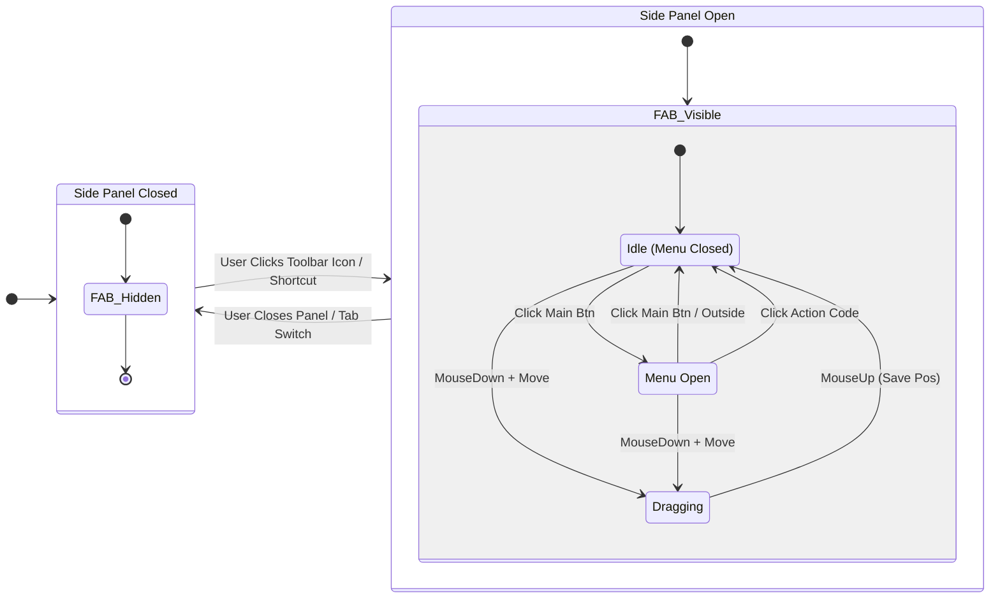
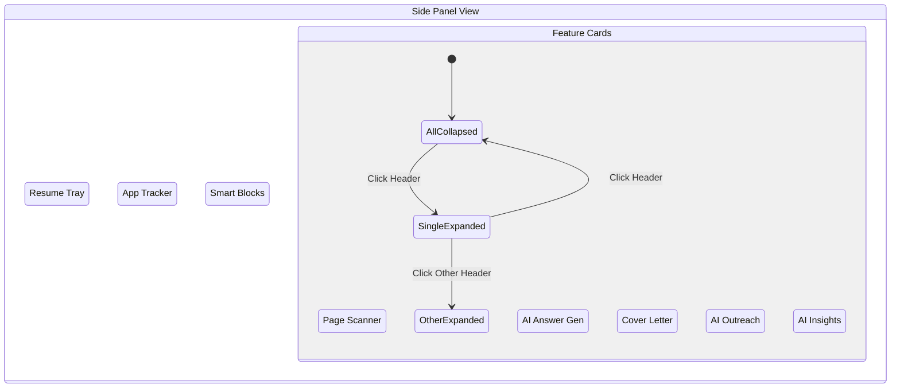
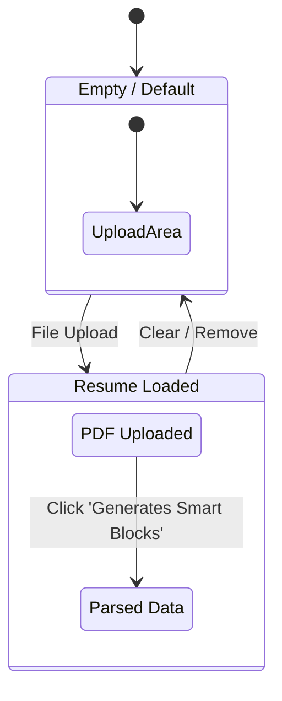
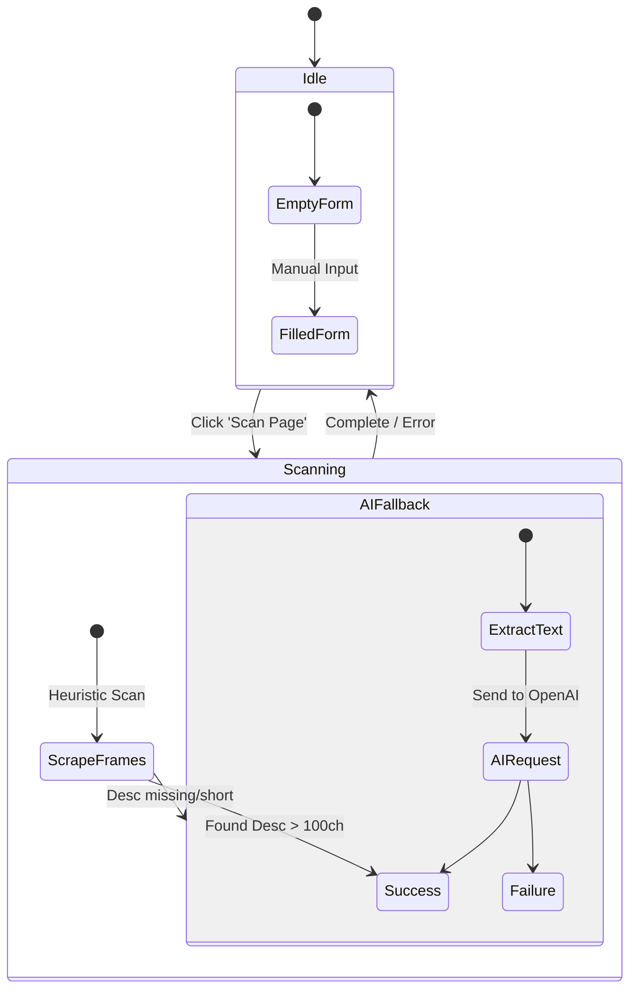
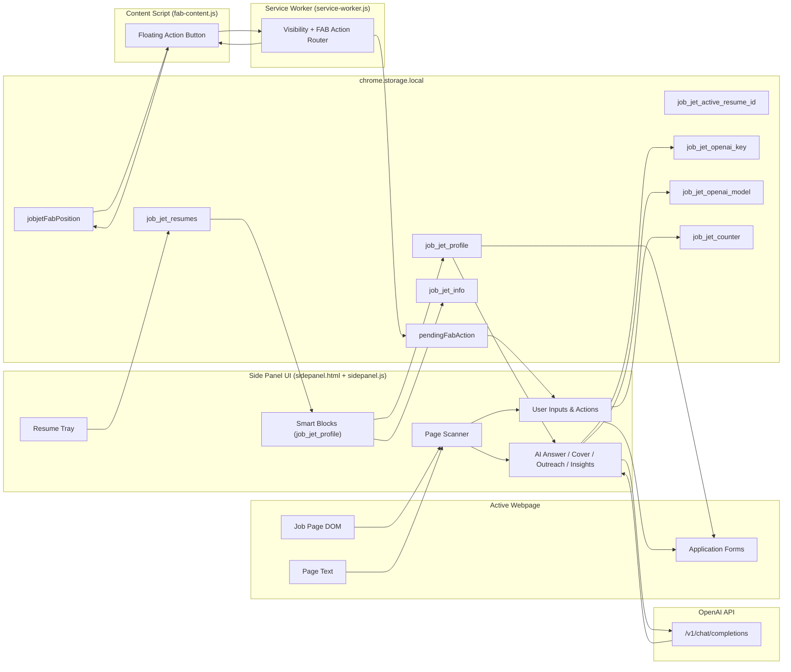
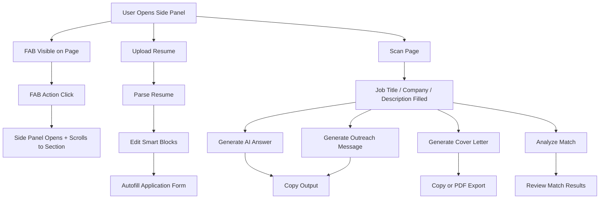

# JobSwyft Chrome Extension - State Diagrams

This document outlines the various state machines within the JobSwyft extension, including the Floating Action Button (FAB) behavior, Side Panel interactions, and key feature workflows.

## 1. Global Visibility & FAB State
The FAB's visibility is strictly coupled with the Side Panel's open state.



## 2. Side Panel - Main View States
The Side Panel manages multiple collapsible sections (Accordion pattern).



## 3. Resume Tray Workflow
Manages the user's uploaded resume data.



## 4. Page Scanner Workflow
Handles scraping job details from the active tab.



## 5. AI Insight Workflow
Manages API Key entry and match analysis.

```mermaid
stateDiagram-v2
    [*] --> CheckState
    
    state CheckState {
        [*] --> NoKey
        [*] --> HasKey
    }
    
    state "Input View" as NoKey {
        [*] --> EnterKey
        EnterKey --> HasKey : Save Clicked
    }
    
    state "Analyze View" as HasKey {
        [*] --> Ready
        Ready --> Analyzing : Click 'Analyze Match'
        Analyzing --> ResultsShown : Success
        Analyzing --> Error : Fail
        
        ResultsShown --> Ready : Re-analyze
        Ready --> NoKey : Remove Key
    }
```

## 6. Data Flow Overview
High-level flow of data between the page, side panel, storage, and OpenAI.



## 7. UI Flow (User Journeys)
Key user journeys through the side panel and FAB actions.


