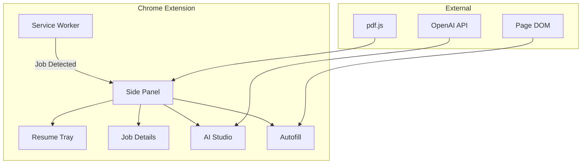

# JobSwyft V1 → V3 Integration Findings

> **Purpose**: Comprehensive analysis of the V1 Chrome extension to enable seamless integration with the new Storybook-based component library.

---

## Table of Contents

1. [Executive Summary](#executive-summary)
2. [V1 Architecture Overview](#v1-architecture-overview)
3. [V1 Features Catalog](#v1-features-catalog)
4. [Existing V2/V3 Storybook Components](#existing-v2v3-storybook-components)
5. [Gap Analysis](#gap-analysis)
6. [Missing Storybook Stories](#missing-storybook-stories)
7. [Implementation Recommendations](#implementation-recommendations)

---

## Executive Summary

The V1 JobSwyft Chrome extension is a **3,500+ line vanilla JavaScript application** with sophisticated features including:
- Multi-platform job detection (18+ ATS platforms)
- AI-powered resume parsing and analysis
- Intelligent form autofill with ATS-specific selectors
- Cover letter, answer, and outreach message generation

The current V2/V3 Storybook component library provides **~10 core components** but is missing several critical UI states and feature-specific stories needed for a complete UI transition.

---

## V1 Architecture Overview

### File Structure

| File | Lines | Purpose |
|------|-------|---------|
| `sidepanel.js` | 3,551 | Main UI logic, AI features, form autofill |
| `service-worker.js` | 230 | Background job detection, URL matching |
| `prompts.js` | 270 | AI prompt templates for all features |
| `sidepanel.html` | 352 | UI structure and layout |
| `styles.css` | TBD | Visual styling |

### Core Components Architecture



### Data Flow

1. **Service Worker** detects job URLs via pattern matching
2. **Storage API** triggers auto-scan notification
3. **Side Panel** scrapes page content and displays job details
4. **AI features** use OpenAI API with structured prompts
5. **Autofill** injects scripts to populate form fields

---

## V1 Features Catalog

### 🔍 Job Detection & Scanning

| Feature | Description | V1 Implementation |
|---------|-------------|-------------------|
| **Multi-Platform Detection** | Detects 18+ ATS platforms | URL pattern matching in `service-worker.js` |
| **Auto-Scan** | Automatically triggers when job page detected | Chrome storage listener + cooldown system |
| **Manual Scan** | User-triggered page scraping | `scrapePageDetails()` injected function |
| **Text Selection Priority** | Uses user-selected text as JD | `window.getSelection()` check |

**Supported Platforms:**
- LinkedIn, Indeed, Glassdoor
- Greenhouse, Lever, Workday
- BambooHR, Greenhouse (Embed)
- SmartRecruiters, ICIMS
- Taleo, SuccessFactors
- Rippling, Ashby, Pinpoint
- Polymer, Workable, Dover

### 📄 Resume Management

| Feature | Description | V1 Implementation |
|---------|-------------|-------------------|
| **Multi-Resume Support** | Store/switch between resumes | Dropdown selector + Chrome storage |
| **PDF Upload** | Parse uploaded PDF files | `pdf.js` library integration |
| **AI Parsing** | Extract structured data via AI | OpenAI API call with JSON schema |
| **Regex Fallback** | Parse without API key | Regex patterns for common sections |
| **Smart Blocks** | Collapsible resume sections | `renderProfileBlocks()` function |

**Smart Blocks Structure:**
```javascript
profile = {
    summary: string,
    skills: string[],
    experience: [{ title, company, startDate, endDate, description, highlights }],
    education: [{ degree, school, startDate, endDate, gpa }],
    projects: [{ name, description, technologies }],
    certifications: string[]
}
```

### 🤖 AI Studio Features

| Feature | Sub-Feature | Description |
|---------|-------------|-------------|
| **Match Analysis** | Score Calculation | 0-100% match score with explanation |
| | Missing Skills | Lists critical skill gaps |
| | Improvement Tips | Actionable recommendations |
| **Cover Letter** | Generation | Creates tailored cover letter |
| | Tone Selection | Professional, Casual, Confident, Friendly |
| | Length Options | Short (~150w), Medium (~250w), Long (~350w) |
| | Custom Instructions | User-provided focus areas |
| | Regeneration with Feedback | Refine based on user input |
| | PDF Export | Download as formatted PDF |
| **Answer Generation** | Question Input | Paste application question |
| | Personalized Answers | Uses resume + job context |
| | Tone/Length Controls | Same as cover letter |
| **Outreach Messages** | LinkedIn Connection | 300 char limit, no subject |
| | LinkedIn InMail | Subject line + body |
| | Cold Email | Full email format |
| | Follow-up Email | Reference previous contact |

### ✍️ Autofill System

| Feature | Description | V1 Implementation |
|---------|-------------|-------------------|
| **ATS-Specific Selectors** | Platform-aware field matching | Hardcoded selector maps |
| **Multi-Tier Matching** | Progressive field detection | Name → Label → Context heuristics |
| **Shadow DOM Support** | Penetrates web components | Recursive Shadow DOM traversal |
| **Event Simulation** | Triggers framework updates | Dispatches input/change/blur events |
| **Resume Upload** | Programmatic file injection | DataTransfer API simulation |

**ATS Selector Categories:**
- Workday-specific selectors
- Greenhouse field patterns
- LinkedIn Easy Apply
- Generic `input[name]` fallbacks

### 📊 Application Tracking

| Feature | Description | V1 Implementation |
|---------|-------------|-------------------|
| **Basic Tracker** | List of applied jobs | Local storage array |
| **Job Metadata** | Title, company, date | Captured on autofill |

---

## Existing V2/V3 Storybook Components

### Component Inventory

| Component | File | Stories | Status |
|-----------|------|---------|--------|
| `ExtensionSidebar` | `extension-sidebar.tsx` | 10 | ✅ Core layout |
| `AIStudio` | `ai-studio.tsx` | 7 | ✅ All 4 sub-tabs |
| `ResumeCard` | `resume-card.tsx` | Multiple | ⚠️ Missing states |
| `JobCard` | `job-card.tsx` | Multiple | ⚠️ Missing states |
| `Autofill` | `autofill.tsx` | Basic | ⚠️ Incomplete |
| `Coach` | `coach.tsx` | Basic | ⚠️ Incomplete |
| `AppHeader` | `app-header.tsx` | Basic | ✅ Complete |
| `CreditBalance` | `credit-balance.tsx` | Basic | ✅ Complete |
| `CreditBar` | `credit-bar.tsx` | Basic | ✅ Complete |
| `LoggedOutView` | `logged-out-view.tsx` | 1 | ✅ Complete |
| `ResumeEmptyState` | Part of stories | 1 | ✅ Complete |
| `EmptyJobState` | `empty-job-state.tsx` | 1 | ✅ Complete |
| `SidebarTabs` | `sidebar-tabs.tsx` | Basic | ✅ Complete |
| `SettingsDialog` | `settings-dialog.tsx` | None | ⚠️ No stories |

### V2 App Integration Stories

The `v2-app.stories.tsx` file provides full-app integration stories:
- `WaitingState` - No job detected
- `NoResumesUploaded` - Empty resume state
- `MultipleResumesList` - Resume dropdown
- `ScanningInProgress` - Loading state
- `ManualEntryMode` - Manual job input
- `JobDetectedUnlocked` - Full functionality
- `AIStudioMatchTab` - AI analysis view
- `CoachState` - Coach feature
- `LoggedOut` - Authentication required

---

## Gap Analysis

### ❌ Critical Missing UI States

| V1 Feature | V2/V3 Status | Gap |
|------------|--------------|-----|
| Resume Parsing Loading | ❌ Missing | No "Parsing Resume..." spinner story |
| Resume Parse Error | ❌ Missing | No error state for failed parse |
| AI Key Input | ❌ Missing | No API key configuration UI |
| AI Model Selection | ❌ Missing | No model dropdown (GPT-4, GPT-3.5) |
| Match Analysis Loading | ⚠️ Partial | `isGenerating` exists but no dedicated story |
| Cover Letter Result | ❌ Missing | No "letter generated" state story |
| Cover Letter Feedback | ❌ Missing | No regeneration UI with feedback input |
| PDF Export UI | ❌ Missing | No export button/confirmation story |
| Answer Generated | ❌ Missing | No "answer ready" result story |
| Outreach Generated | ❌ Missing | No "message ready" result story |
| Autofill Progress | ❌ Missing | No "filling fields..." loading state |
| Autofill Results | ❌ Missing | No "X fields filled" success summary |
| Resume Upload Progress | ❌ Missing | No file upload loading state |
| Job Scan Error | ❌ Missing | No "failed to detect job" error state |
| Low Credits Warning | ⚠️ Partial | Exists but no modal/dialog |
| Application Tracker | ❌ Missing | No tracker list component/story |

### ❌ Missing Functional Stories

| Feature | Current State | Required Story |
|---------|---------------|----------------|
| Toast Notifications | None | Success/error toast patterns |
| Copy to Clipboard | None | Copy button + confirmation |
| Collapsible Cards | Partial | Full collapse/expand animation |
| Skill Tags | In ResumeCard | Standalone skill badge component |
| Platform Detection Badge | None | Shows "LinkedIn", "Greenhouse" etc. |
| Scan Cooldown Indicator | None | "Wait X seconds" message |

---

## Missing Storybook Stories

### 🔴 High Priority (Block Core Flows)

#### 1. Resume Upload Flow Stories
```
ResumeCard.stories.tsx:
  - UploadingState: File being processed
  - ParsingWithAI: AI extraction in progress  
  - ParsingFallback: Regex parsing (no API key)
  - ParseError: Failed to extract data
  - ParseSuccess: Newly parsed with highlight
```

#### 2. AI Studio Result States
```
AIStudio.stories.tsx:
  - MatchAnalysisLoading: Skeleton/spinner
  - MatchAnalysisError: API failure
  - CoverLetterGenerated: Letter in textarea
  - CoverLetterWithFeedback: Regeneration mode
  - CoverLetterExporting: PDF generation
  - AnswerGenerated: Answer in textarea
  - OutreachGenerated: Message in textarea
```

#### 3. Autofill Journey Stories
```
Autofill.stories.tsx:
  - Ready: Resume selected, waiting for trigger
  - InProgress: Filling fields animation
  - Success: "12/15 fields filled" summary
  - PartialSuccess: Some fields failed
  - NoFieldsDetected: Empty form error
  - ResumeUploadStart: File injection
  - ResumeUploadSuccess: File accepted
```

#### 4. Settings & Configuration
```
SettingsDialog.stories.tsx:
  - Default: Basic settings view
  - APIKeyInput: Key entry/validation
  - ModelSelection: GPT-4/GPT-3.5 dropdown
  - KeySaved: Success confirmation
  - KeyInvalid: Error state
```

### 🟡 Medium Priority (Enhance UX)

#### 5. Notification Components
```
Toast.stories.tsx:
  - CopySuccess: "Copied to clipboard"
  - GenerationComplete: "Cover letter ready"
  - AutofillComplete: "Fields populated"
  - ErrorGeneric: Red error toast
  - Warning: Low credits warning
```

#### 6. Application Tracker
```
ApplicationTracker.stories.tsx:
  - Empty: No applications tracked
  - WithApplications: List of applied jobs
  - AddingApplication: New entry animation
```

#### 7. Platform Detection
```
PlatformBadge.stories.tsx:
  - LinkedIn
  - Indeed
  - Greenhouse
  - Lever
  - Workday
  - Generic/Unknown
```

### 🟢 Lower Priority (Polish)

#### 8. Empty & Error States
```
EmptyStates.stories.tsx:
  - NoResumeScan: Resume required first
  - NoJobScan: Job required first
  - NetworkError: API unreachable
  - CooldownActive: Scan cooldown message
```

#### 9. Skeleton Loaders
```
Skeletons.stories.tsx:
  - JobCardSkeleton
  - ResumeCardSkeleton
  - MatchAnalysisSkeleton
  - TextGenerationSkeleton
```

---

## Implementation Recommendations

### Phase 1: Critical Path (Week 1)

1. **Add AI Studio result state stories**
   - These block QA on the core feature
   - Focus on cover letter flow first

2. **Add autofill journey stories**
   - Essential for testing form integration
   - Include failure states

3. **Create Settings/API key component**
   - V1 has inline key input
   - V2 needs proper modal

### Phase 2: Enhanced States (Week 2)

4. **Resume upload/parse flow**
   - Loading, error, success states
   - Progress indication

5. **Toast notification system**
   - Reusable feedback component
   - Consistent error handling

### Phase 3: Polish (Week 3)

6. **Application tracker MVP**
7. **Platform detection badges**
8. **Skeleton loaders for perceived performance**

---

## Appendix: V1 Function Reference

| Function | Purpose | Lines |
|----------|---------|-------|
| `setupResumeTray()` | Initialize resume UI | ~100 |
| `renderResumeList()` | Render resume dropdown | ~80 |
| `triggerResumeParse()` | Orchestrate PDF parsing | ~150 |
| `parseResumeToProfile()` | Regex fallback parser | ~200 |
| `setupAIAnalysis()` | Match analysis UI setup | ~100 |
| `scrapePageDetails()` | Extract job from page | ~150 |
| `injectedFormFiller()` | Multi-tier autofill | ~400 |
| `injectedResumeUploader()` | Programmatic file upload | ~50 |

---

*Document generated: Analysis of V1 Code for V3 Integration*
