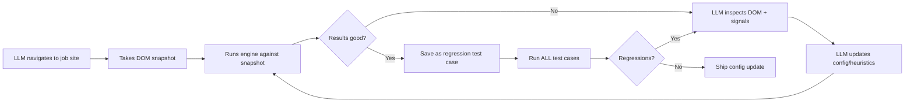

# JobSwyft Smart Engine — Architecture Vision

> **Status:** Living document · **Author:** Architecture session 2026-02-13
> **Scope:** Problem definition, goals, design principles, and capability layers. Not a tech spec — solutionizing comes later per-layer.
> **Diagram:** [Architecture Diagram](./smart-engine-architecture.mermaid)

---

## 1. What We're Building

A unified **detection + extraction + autofill engine** that:

- Identifies job pages and application forms across hundreds of sites
- Extracts job data (title, company, description, salary, etc.)
- Detects form fields for autofill (name, email, resume upload, custom questions, etc.)
- Adapts when sites change without requiring code deploys
- Learns from failures via user feedback and LLM-driven iteration
- Runs entirely client-side (extension) with AI backend as last-resort fallback

---

## 2. Problems We're Solving

### 2.1 Fragile Detection

Sites change their DOM frequently. CSS selectors that worked last week break silently. There's no alerting — the engine just stops extracting fields on that site.

### 2.2 Blind LLM Development

The LLM builds detection heuristics but can't test them against real extension behavior. It can't see:

- Extension logs or side panel state
- Which fields were detected vs. missed
- Why a selector matched or didn't
- The actual DOM of the page under test

Result: slow back-and-forth development loops with no real feedback.

### 2.3 Incomplete Field Coverage

The current `AutofillFieldType` union covers ~35 known field types. But real-world forms have:

- Custom screening questions ("Why do you want to work here?")
- Questions outside our domain ("Do you have a security clearance?")
- Multi-step forms with hidden sections behind "Show more" buttons
- Dynamic fields that appear after other fields are filled

If a field doesn't match our type registry, we currently ignore it — even though it's part of the same form and the user would benefit from AI-assisted filling.

### 2.4 Unintended Side Effects

The engine sometimes auto-clicks elements, expands form sections, or triggers unintended navigation. There's no clear separation between **reading** the page state and **acting** on it.

### 2.5 No User Feedback Loop

When extraction fails, the user has no way to:

- Tell us which element they expected us to detect
- Report a broken page so we can add support
- Contribute corrections that improve the system for everyone

### 2.6 No Regression Safety

There's no automated way to verify that a change to the detection engine doesn't break previously-working sites.

---

## 3. Design Principles

| Principle                          | Meaning                                                                                                                                  |
| ---------------------------------- | ---------------------------------------------------------------------------------------------------------------------------------------- |
| **Read-only first**                | Engine MUST NOT click, expand, or modify the DOM during detection. Observation only. Surface "Show more" opportunities as user messages. |
| **Graceful degradation**           | Multiple extraction layers, each more expensive. Only escalate when the cheaper layer fails.                                             |
| **Audit everything**               | Every detection decision has a traceable signal chain. "Why did we classify this as `email`?" must be answerable.                        |
| **Testable without Chrome**        | Core engine logic runs in Node.js, against saved DOM snapshots. No `chrome.*` API dependency in detection functions.                     |
| **LLM-observable**                 | All engine outputs are structured, loggable, and inspectable by the LLM during development.                                              |
| **User-correctable**               | When the engine fails, the user can point at what's wrong, and that feedback flows back into the system.                                 |
| **Config-driven, not code-driven** | Site support should be data (JSON configs) that can be updated without code changes.                                                     |
| **Ship selectors, not code**       | New site support = new config entries, pushed via backend sync — not extension releases.                                                 |

---

## 4. Capability Layers (Graceful Degradation)

Detection runs top-to-bottom. Each layer is more expensive. Stop as soon as confidence is sufficient.

```
┌──────────────────────────────────────────────────────┐
│  Layer 0: URL Pattern Match                          │
│  "Are we on a job/application page?"                 │
│  Cost: zero · Speed: instant                         │
│  Uses: ats-detector.ts, job-detector.ts              │
└──────────────┬───────────────────────────────────────┘
               │ yes → proceed
┌──────────────▼───────────────────────────────────────┐
│  Layer 1: Structured Data Extraction                 │
│  JSON-LD, OpenGraph, meta tags                       │
│  Cost: zero · Speed: <10ms                           │
│  Uses: scanner.ts (JSON-LD parser)                   │
└──────────────┬───────────────────────────────────────┘
               │ if completeness < threshold
┌──────────────▼───────────────────────────────────────┐
│  Layer 2: CSS Selector Registry (strict match)       │
│  Board-specific + generic selectors from registry    │
│  Cost: zero · Speed: <50ms                           │
│  Uses: selector-registry.ts, scanner.ts              │
└──────────────┬───────────────────────────────────────┘
               │ if completeness < threshold
┌──────────────▼───────────────────────────────────────┐
│  Layer 3: Heuristic / Fuzzy Detection                │
│  Multi-signal scoring (labels, aria, placeholders)   │
│  Finds fields NOT in our registry                    │
│  Cost: zero · Speed: <100ms                          │
│  Uses: field-detector.ts                             │
└──────────────┬───────────────────────────────────────┘
               │ if completeness < threshold
┌──────────────▼───────────────────────────────────────┐
│  Layer 4: AI Backend Scan (last resort)              │
│  Send cleaned HTML to backend LLM extraction         │
│  Cost: API call · Speed: 1-5s                        │
│  Uses: POST /v1/ai/extract-job                       │
│  Rate limited: 50/user/day · No credit cost          │
└──────────────────────────────────────────────────────┘
```

> [!IMPORTANT]
> **Layer 4 is the safety net, not the primary path.** The goal is to make Layers 1-3 so good that Layer 4 is rarely needed.

---

## 5. Unknown / Custom Field Handling

### The Problem

Forms contain questions we haven't typed. Currently, these are either `"customQuestion"` or `"unknown"` and mostly ignored.

### The Goal

If a field is part of the same `<form>` or form-like container, and the user might want to autofill it, we should:

1. **Detect it** — even if we can't classify it by type
2. **Surface it** — show the user "We found 3 additional questions on this form"
3. **Enable AI fill** — let the user click to generate an answer using their resume + job context
4. **Learn from it** — if users frequently fill the same type of unknown field, promote it to a known type

### Classification Tiers

| Tier                 | Example                                         | Engine Action                                          |
| -------------------- | ----------------------------------------------- | ------------------------------------------------------ |
| **Known**            | First name, email, LinkedIn URL                 | Auto-map to user data, ready to fill                   |
| **Inferrable**       | "Years of React experience" → `yearsExperience` | Use fuzzy matching / AI classification to map          |
| **Fillable-unknown** | "Why do you want this role?"                    | Show as "custom question," enable AI answer generation |
| **Out-of-scope**     | CAPTCHA, file uploads for portfolio             | Skip, don't show                                       |

---

## 6. Page State Awareness (Read-Only)

### The Problem

Some content is hidden behind "Show more," accordion toggles, or multi-step wizards. The engine shouldn't auto-click these, but should inform the user.

### Approach

- Engine operates in **read-only** mode during detection — no DOM mutations
- Detect actionable elements: "Show more" buttons, collapsed sections, next-step buttons
- Surface these as **user messages**: _"There may be more fields behind the 'Show more' button. Click it to scan additional fields."_
- After the user clicks, the engine can re-scan the updated DOM
- **Never auto-click** — this prevents unintended side effects (form submissions, navigation, analytics triggers)

### Detectable Cues

- Buttons/links containing text: "show more", "additional questions", "next", "continue"
- `aria-expanded="false"` on containers near form elements
- `display: none` / `visibility: hidden` sections within the form container
- `<details>` elements that are not `open`

---

## 7. User Feedback & Correction System

### 7.1 Element Selection Mode - "Selector Strategy"

When the user selects an element, we must generate a selector that is robust to DOM changes, not just a brittle path.

**The "Anchor & Path" Algorithm:**

1. **The Golden ID:** Use `data-testid`, unique `id`, or unique `name`.
2. **Semantic Anchor:** Locate nearest stable parent (e.g., `<form>`, Header).
3. **Label Matching:** Use text of associated `<label>` tag if present.

### 7.2 Feedback Data Model

```typescript
UserCorrection {
  url_pattern: string          // generalized URL (not exact URL)
  board: string                // detected or user-specified ATS
  selector_strategy: {         // Robust 3-layer fallback
      primary_selector: string
      anchor_context: string
      label_text?: string
  }
  expected_field_type: string
  timestamp: Date
  user_id: string
}
```

### 7.3 Storage & Aggregation

- **Local:** Chrome storage `storage.local`
- **Backend:** `POST /v1/feedback/correction`
- **Constraint:** User Corrections are pinned locally and override Global Configs (see Conflict Resolution).

### 7.4 The Honey Model

Like PayPal Honey's checkout page support:

- Users can **request support** for a page that isn't working
- Other users voting on the same page raises its priority
- New site support ships as **config updates** (selector registry entries), not code deploys
- Backend maintains a "site support requests" queue with vote counts

---

## 8. Shared Configuration & Remote Sync

### Config as Data

The `selector-registry.ts` today is a hardcoded TypeScript array. The vision:

```
Extension starts
  → Loads local config from chrome.storage.local
  → Checks backend for config updates (versioned)
  → Merges: remote config + local user corrections
  → Engine runs against merged config
```

### Conflict Resolution Strategy ("User Strict, Global Loose")

When merging Remote Config with Local User Corrections:

1. **User Wins:** If a Local Correction exists for a field, it overrides the Remote Config.
2. **Convergence:** If the Remote Config has been updated to match the Local Correction, the Local Correction is silently pruned.
3. **Divergence UI:** If Remote Config disagrees with Local Correction, show a UI indicator allowing the user to "Update to Official" or "Keep Custom".

### Versioning

- Each config has a `version` number
- Extension stores `lastSyncVersion` in `chrome.storage.local`
- On startup/periodic: `GET /v1/config?since={version}` → delta updates only
- No full registry download every time

---

## 9. LLM Development Workflow

### The Problem Today

The LLM writes heuristic code → you build the extension → load it in Chrome → test → describe what failed → LLM guesses a fix → repeat. No direct feedback.

### The Vision: LLM-in-the-Loop Development



### How This Works Technically

**Step 1: Decouple the engine from Chrome APIs**

- Core detection functions are already pure (injected via `executeScript`)
- They take DOM + config as input, return structured results
- These can run in Node.js against saved HTML snapshots

**Step 2: Test harness**

- A local dev server or script that:
  - Loads a saved DOM snapshot (or the LLM takes a live one)
  - Runs the engine
  - Outputs structured results to console
  - LLM reads results, modifies engine, re-runs
  - Instant feedback loop — no Chrome rebuild needed

**Step 3: Regression test suite**

- Each tested page becomes a snapshot + expected results
- Stored in `test-cases/` directory
- After any engine change, run all test cases
- CI can also run these

**Step 4: LLM observability**

- Engine outputs structured logs: every signal evaluated, scores, match/no-match reasons
- These logs are JSON — the LLM can parse and reason about them
- The `SignalEvaluation[]` audit trail in `field-types.ts` is already designed for this

---

## 10. Privacy & Sanitization (The "PII Firewall")

### Constraint

Layer 4 (AI Backend) requires sending HTML snapshots to the server. This introduces a privacy risk if users have pre-filled forms with sensitive data (e.g., via browser autofill).

### Solution: Client-Side Content Scrubbing

Before any HTML snapshot leaves the client, it must pass through a sanitizer that performs a **destructive shallow clone**:

1. **Value Nuking:** Force `.value=""` and `.checked=false` on all inputs.
2. **Attribute Scrubbing:** key attributes like `data-initial-value` or `placeholder` (if containing PII patterns) are removed.
3. **Tag Stripping:** Remove `<script>`, `<style>`, `<iframe`, `<object>` to ensure safety and reduce payload size.

---

## 11. What Exists Today (Inventory)

| Module                                                                                                                    | Purpose                                           | Maturity                           |
| ------------------------------------------------------------------------------------------------------------------------- | ------------------------------------------------- | ---------------------------------- |
| [scanner.ts](file:///Users/enigma/Developer/jobswyft/apps/extension/src/features/scanning/scanner.ts)                     | Job data extraction (title, company, description) | Working, covers JSON-LD + CSS      |
| [selector-registry.ts](file:///Users/enigma/Developer/jobswyft/apps/extension/src/features/scanning/selector-registry.ts) | 526 lines of board-specific CSS selectors         | Substantial, needs health tracking |
| [job-detector.ts](file:///Users/enigma/Developer/jobswyft/apps/extension/src/features/scanning/job-detector.ts)           | URL-based job page detection                      | Working                            |
| [ats-detector.ts](file:///Users/enigma/Developer/jobswyft/apps/extension/src/features/autofill/ats-detector.ts)           | URL-based ATS form detection                      | Working, 15+ ATS patterns          |
| [field-detector.ts](file:///Users/enigma/Developer/jobswyft/apps/extension/src/features/autofill/field-detector.ts)       | Multi-signal form field detection (621 lines)     | Complex, needs testing             |
| [field-filler.ts](file:///Users/enigma/Developer/jobswyft/apps/extension/src/features/autofill/field-filler.ts)           | Injects values into detected fields               | Exists, untested broadly           |
| [field-registry.ts](file:///Users/enigma/Developer/jobswyft/apps/extension/src/features/autofill/field-registry.ts)       | ATS-specific field selector data                  | Exists                             |
| [field-types.ts](file:///Users/enigma/Developer/jobswyft/apps/extension/src/features/autofill/field-types.ts)             | Type system with audit trail support              | Well-designed, 272 lines           |
| Backend `/v1/ai/extract-job`                                                                                              | AI fallback extraction                            | Working, rate-limited              |

> [!TIP]
> The foundation is solid. The types in `field-types.ts` already include `SignalEvaluation` audit trails, `confidence` scores, and `DetectionResult` page-level summaries. The architecture vision is about **connecting the pieces** and **closing the feedback loop**, not starting from scratch.

---

## 12. Next Steps

1. **Build the test harness** — so the LLM can iterate on detection logic with real feedback
2. **Extract engine as standalone module** — ensure zero `chrome.*` dependency in detection logic
3. **Add regression test suite** — snapshot-based, runnable in CI and by LLM
4. **Implement unknown-field surfacing** — detect and present "custom questions" to the user
5. **Design the user correction UX** — element selection mode prototype
6. **Build config sync endpoint** — versioned selector registry served from backend
7. **Stress-test on 10 ATS platforms** — using the LLM development loop
