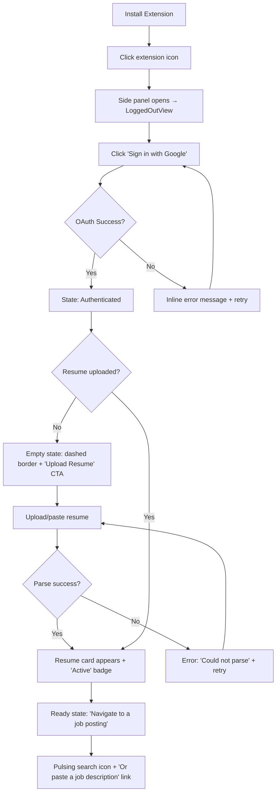
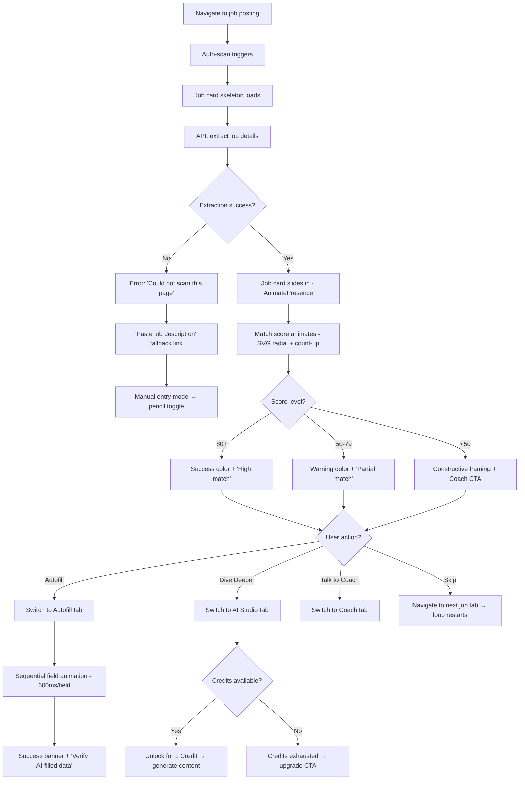
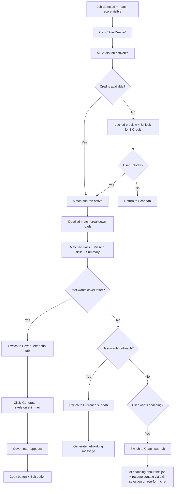
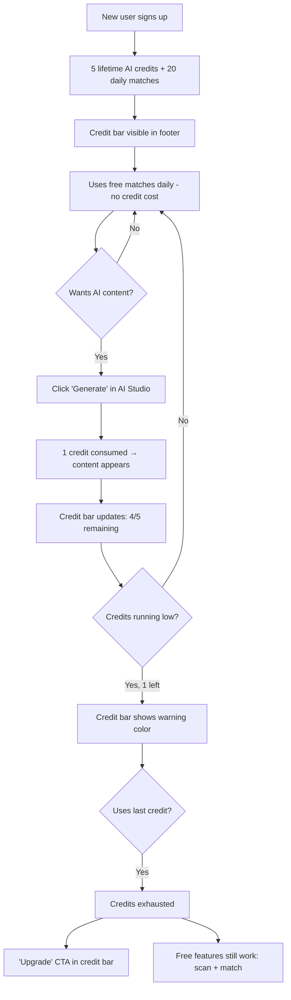

# UX Design Specification - Jobswyft

**Author:** jobswyft
**Date:** 2026-02-07

---

## Executive Summary

### Project Vision

Jobswyft is an AI-powered Chrome Side Panel assistant (400px fixed width) that transforms job applications from a tedious multi-tab process into a streamlined, intelligent workflow. The extension lives alongside job boards (LinkedIn, Indeed, Greenhouse, etc.) and provides real-time scanning, AI analysis, and one-click autofill — enabling users to apply 5x faster with higher quality applications.

The product follows a **three-state progressive unlock model**:
1. **Logged Out** — Feature showcase + Google sign-in CTA
2. **Non-Job Page** — Resume management + waiting state
3. **Job Detected = Full Power** — All features unlocked: scan results, quick match, AI Studio (match, cover letter, outreach, coach), autofill

### Target Users

**Primary persona: Marcus (Active Job Hunter, "Speed Demon")**
- Applies to 5-10 jobs daily, values speed above all
- Core need: reduce per-application time from 15+ minutes to 3 minutes
- Design implications: high information density, zero unnecessary clicks, instant feedback
- Marcus is our design-first persona — every UX decision optimizes for his workflow

**Secondary personas:**
- **Aisha (Career Changer)** — Needs coaching and skill gap analysis
- **David (Passive Browser)** — Casual scanning, occasional deep dives
- **Jenna (Recent Graduate)** — Needs guidance on application quality

### Key Design Challenges

1. **400px Constraint** — Every pixel matters. Must deliver high-density information without feeling cramped. Progressive disclosure (collapsible sections, locked/unlocked states, auto-collapse on scroll) is essential.

2. **Three-State Transitions** — Smooth transitions between sidebar states that feel natural, not jarring. Users must always understand where they are and what capabilities are available.

3. **AI Latency Communication** — Match analysis takes 2-3 seconds, cover letter generation longer. Users need engaging feedback (animated score fill, sequential field completion) rather than generic spinners.

4. **Functional Color System** — Four feature areas (Scan/blue, AI Studio/violet, Autofill/emerald, Coach/orange) each need distinct color identity implemented through semantic CSS variables, not hardcoded Tailwind classes.

5. **Dark Mode Parity** — Every component, every state, every animation must work flawlessly in both light and dark modes with OKLCH semantic tokens.

### Design Opportunities

1. **Animated Match Score** — SVG radial fill + count-up animation creates a "moment of truth" that rewards waiting. Borrowed from Builder.IO prototype.

2. **Sequential Autofill Animation** — Staggered field-by-field completion (600ms per field) communicates "AI is working" far better than a progress bar. Shows each field individually being filled.

3. **Gradient Depth Buttons** — `bg-gradient-to-br` + `border-t border-white/20` (glass edge) + colored shadow glow on hover. Used sparingly for primary CTAs only.

4. **Framer Motion State Transitions** — `AnimatePresence` with slide animations (`x: 20 → 0`) between sidebar states creates spatial continuity.

5. **Credit Lock Pattern** — Show locked AI Studio content with visual preview + "Unlock for 1 Credit" button. Users see the value before spending credits.

6. **Two-Tone Card Pattern** — Cards divided into main body + accent-tinted section (e.g., `bg-primary/5` footer with `border-t`). Creates subtle visual hierarchy within a single card. Inspired by Builder.IO's JobCard where the match summary footer uses a brand-primary tinted background. This pattern can be applied flexibly — the accent zone doesn't have to be at the bottom; it can highlight any section that needs visual separation (header, footer, or action area).

7. **Dashed Border Empty States** — For incomplete/missing items (e.g., "Resume not uploaded"), use `border-2 border-dashed` to visually communicate incompleteness alongside pulsing icons and descriptive text. The dashed border signals "something belongs here" more effectively than just text.

### Existing Design Assets

Three prototype sources have been audited and their best patterns catalogued:

| Source | Strengths to Keep | Weaknesses to Fix |
|--------|------------------|-------------------|
| **Main branch** (`packages/ui/`) | OKLCH semantic tokens, shared components (IconBadge, SkillPill, MatchIndicator), zero hardcoded colors, cross-cutting patterns | No animations, no per-tab color identity, no state transitions |
| **Adaptive branch** (`feat/adaptive-sidebar-maxed-out`) | Per-tab functional colors, gradient buttons, auto-collapse context, micro-interactions (scale, shadow glow) | Hardcoded Tailwind colors everywhere, inlined components, text-[10px] regression, size pattern broken |
| **Builder.IO** (`interactive-builder-bb8`) | Animated SVG match score, sequential autofill, framer-motion transitions, credit lock pattern, `brand-primary` semantic token, two-tone card pattern, dashed border empty states | HSL not OKLCH, Tailwind v3 config, no dark mode refinement |

### Architecture Decisions

| Decision | Choice | Rationale |
|----------|--------|-----------|
| Sidebar tabs | 4: Scan \| AI Studio \| Autofill \| Coach | Coach is a dedicated main-level tab for career coaching |
| AI Studio sub-tabs | 4: Match \| Cover Letter \| Outreach \| Chat | Chat (general job-context AI Q&A) is the 4th AI Studio sub-tab |
| Color system | OKLCH semantic CSS variables per functional area | Main branch pattern, extended with area-specific tokens; Builder.IO's `brand-primary`/`success`/`warning` token approach validated |
| Coach color | Independent `--coach-*` semantic variable | Separate from `--primary` (brand orange) |
| Animation library | Framer Motion for state transitions + match score | CSS animations for micro-interactions (tab scale, button glow) |
| Component strategy | Rebuild from scratch using shared primitives | Clean slate combining best patterns from all 3 prototypes |
| Empty state pattern | Pulsing icon + descriptive text + dashed border | Dashed border for missing/incomplete items communicates "something belongs here" |
| Card hierarchy | Two-tone card with accent-tinted section | `bg-primary/5` zone + `border-t` creates visual hierarchy within cards |
| Design-first persona | Marcus (speed demon) | High density, low noise, zero unnecessary clicks |

## Core User Experience

### Defining Experience

The core experience is the **Scan → Analyze → Apply loop** — Marcus's 30-second flow:

1. **Land** on job page → side panel auto-detects URL change
2. **Scan** → job details extracted automatically, match score animates in (SVG radial fill + count-up)
3. **Decide** → skills matched/missing at a glance, one-line AI summary
4. **Act** → "Dive Deeper" (AI Studio) or "Autofill" (one-click apply) or skip to next
5. **Repeat** → next browser tab, loop restarts

This loop must feel instantaneous. The scan happens without a button press. The match score rewards the 2-3 second wait with animation. The decision point is visible without scrolling. The action buttons are always within thumb reach (bottom of visible area).

### Platform Strategy

- **Surface:** Chrome Side Panel — user-resizable, no programmatic width control
- **Width range:** 360px minimum (Chrome-enforced) → ~50% of window maximum (user-draggable)
- **Default width:** ~360px (resets every browser session — Chrome does not persist)
- **Design target:** Fluid layouts that work from 360px to 700px. No fixed-width assumptions.
- **Input:** Mouse/keyboard primary (desktop browser context)
- **Connectivity:** Always online (AI features require API calls)
- **Chrome APIs leveraged:**
  - Side Panel API — persistent panel alongside job boards
  - Identity API — Google OAuth via `launchWebAuthFlow`
  - Tabs API — URL change detection for auto-scan triggers
  - Scripting API — DOM injection for autofill field population
- **Offline:** No offline mode. Graceful degradation with clear "no connection" state.

**Storybook Viewports:**

| Viewport | Width × Height | Purpose |
|----------|---------------|---------|
| Side Panel (default) | 360 × 600 | Chrome's default opening width — primary design target |
| Side Panel (wide) | 500 × 600 | Users who drag the panel wider |
| Mobile | 375 × 667 | Future web app reference |
| Tablet | 768 × 1024 | Future web app reference |

### Job-Switching & Context Management

The side panel always reflects the active browser tab — no manual action required.

**Auto-scan behavior:**
- Navigating to a new job page triggers auto-scan → new job card + match score
- Navigating to a non-job page (Gmail, docs, etc.) preserves the last job context
- Match score uses daily free allocation (20/day), not AI credits

**Context reset on job switch:**
- Job card: replaced with new job details
- Match score: new score animates in
- AI Studio: all tabs reset to "Generate" state (content is job-specific), including Chat history
- Coach: conversation cleared (new job = new coaching context)
- Resume: **persists** (resume doesn't change between jobs)
- Credits & auth: **persist**

**Manual reset:**
- Small reset button in the sidebar header area
- Returns extension to "Waiting for Job Detection" state
- Clears job, match, AI Studio (including Chat), Coach conversation — keeps resume, auth, credits

### Effortless Interactions

These interactions must require **zero cognitive effort**:

| Interaction | How It's Effortless |
|-------------|-------------------|
| Job detection | Auto-scan on URL change — no button press needed |
| Job switching | Auto-scan replaces previous job; non-job pages are safe |
| State transitions | Panel auto-adjusts to page context (logged out → authenticated → job detected → full power) |
| Resume selection | Active resume pre-selected; switchable but not required |
| Theme | Follows system dark/light preference automatically |
| Credit awareness | Always visible in footer bar, never blocking until exhausted |
| Tab switching | Sidebar tabs remember last state per feature area |

### Critical Success Moments

1. **First Match Score** — The animated SVG radial fill + count-up number is the "wow" moment. If this feels magical, Marcus is hooked. Must animate smoothly (1.5-2s duration, easeOut).

2. **First Autofill** — Sequential field-by-field animation completing in 3-4 seconds. Each field gets a checkmark as it fills. "It just... filled everything." Must include disclaimer: "Always verify AI-filled data."

3. **First Cover Letter** — AI generates a personalized letter in seconds. Quality must be immediately impressive — no generic filler.

4. **Credit Lock → Unlock** — User sees a blurred/locked preview of AI Studio content + "Unlock for 1 Credit" button. Spending the credit reveals the full result. Value exchange must feel fair and transparent.

5. **Coach Conversation** — First AI coach response must feel personalized to the user's resume + the specific job. Generic career advice = failure.

### Experience Principles

| # | Principle | What It Means in Practice |
|---|-----------|--------------------------|
| 1 | **Speed is the Feature** | Every interaction optimized for Marcus's 30-second loop. No loading screens — animated feedback instead. Zero unnecessary clicks. |
| 2 | **Show, Don't Tell** | Animated match scores over text percentages. Sequential autofill over progress bars. Dashed borders over "empty" text. Two-tone cards over flat cards. |
| 3 | **Progressive Disclosure** | Don't overwhelm in 400px. Collapse what's not immediately needed. Lock what costs credits. Expand on demand. |
| 4 | **Color Has Meaning** | Every functional area owns its color identity. Colors are semantic (success/warning/destructive), not decorative. |
| 5 | **Earn Trust Through Transparency** | Show what AI is doing (sequential fills, score breakdowns). Show credit costs before spending. Never hide errors. |

## Desired Emotional Response

### Primary Emotional Goals

The three feelings that define Jobswyft:

1. **"I'm faster than everyone else"** — Competitive advantage. Marcus should feel like he has a superpower. The auto-scan, instant match score, one-click autofill — these should make him feel like he's operating at a higher level than applicants without Jobswyft.

2. **"I can trust this"** — Confidence without second-guessing. The match score breakdown, the skill-by-skill analysis, the sequential autofill showing each field — these build trust by showing the work, not just the result. Marcus shouldn't need to double-check everything AI produces.

3. **"That was satisfying"** — Micro-dopamine hits. The match score animating in, the autofill fields checking off one by one, the gradient buttons with glow — these should create small moments of satisfaction that make the loop addictive.

### Emotional Journey Mapping

| Stage | Target Emotion | Anti-Emotion (Avoid) | Design Lever |
|-------|---------------|---------------------|-------------|
| **First open (logged out)** | Intrigued, "this looks legit" | Skepticism, "another tool" | Clean feature showcase, professional visual polish, two-tone CTA card |
| **Sign in** | Effortless, "that was easy" | Friction, "why do I need to..." | One-click Google OAuth, no email forms |
| **First scan** | Surprised, "it just... knew" | Confusion, "what do I do?" | Auto-scan with no button press, job card slides in with animation |
| **Match score reveal** | Excitement, anticipation | Boredom, "just show me a number" | SVG radial fill + count-up animation (1.5-2s) |
| **High match (80+)** | Confidence, "I should apply" | Doubt | Green success color, encouraging summary text |
| **Low match (<50)** | Informed, not defeated | Discouragement, shame | Constructive framing ("missing skills" not "you lack"), coaching CTA |
| **Autofill running** | Satisfaction, watching progress | Anxiety, "is it working?" | Sequential field animation with checkmarks |
| **Cover letter generated** | Impressed, "this is good" | Disappointment, "this is generic" | Personalized content referencing specific resume + job details |
| **Credits running low** | Aware, planning ahead | Panic, feeling trapped | Gentle warning in credit bar, not blocking dialogs |
| **Credits exhausted** | Clear on options, not punished | Frustration, paywall anger | Clear messaging, still shows free features (match analysis) |
| **Error state** | "I know what happened" | Confusion, lost work | Honest error messages, no jargon, retry actions |
| **Return visit** | "Right where I left off" | "I have to set up again" | Resume persists, last state remembered |

### Micro-Emotions

| Micro-Emotion | Priority | How We Achieve It |
|---------------|----------|-------------------|
| **Confidence over Confusion** | Critical | Progressive disclosure — show only what's relevant to current state. Clear labels. No ambiguous icons. |
| **Trust over Skepticism** | Critical | Show AI's work (skill breakdowns, field-by-field fill). "Always verify" disclaimer. Never hide costs. |
| **Accomplishment over Frustration** | High | Every completed action gets feedback — checkmarks, score reveals, success banners. |
| **Delight over Mere Satisfaction** | Medium | Gradient buttons with glow, animated transitions, two-tone cards — polish that feels premium without being flashy. |
| **Control over Helplessness** | High | Manual reset button, editable job details, ability to regenerate AI content. User is never stuck. |

### Design Implications

| Emotional Goal | UX Design Choice |
|---------------|-----------------|
| "I'm faster" | Auto-scan (zero clicks), one-tap autofill, keyboard shortcuts for power users |
| "I can trust this" | Show match score breakdown, sequential autofill animation, "Always verify" disclaimers |
| "That was satisfying" | Animated match score, gradient depth buttons, two-tone cards, success state animations |
| Avoid frustration | Never block with modals. Errors are inline, actionable, and honest. |
| Avoid confusion | State transitions use AnimatePresence (spatial continuity). Job card IS the context indicator. |
| Avoid paywall anger | Free tier is genuinely useful (20 daily matches). Credit costs shown before spending. Lock pattern shows preview of what credits buy. |

### Emotional Design Principles

| # | Principle | Application |
|---|-----------|-------------|
| 1 | **Reward the wait** | Never show a generic spinner. Every loading state has purposeful animation (score fill, field completion, skeleton shimmer). |
| 2 | **Celebrate completion** | Every completed action gets visible feedback — checkmarks, score reveals, success banners, subtle scale bounces. |
| 3 | **Fail gracefully** | Errors are never dead ends. Always show what happened, why, and what the user can do next. Use destructive color sparingly — only for true errors, not warnings. |
| 4 | **Respect the user's intelligence** | No tutorials, no tooltips on obvious actions, no "Are you sure?" dialogs for reversible actions. Marcus knows what he's doing. |
| 5 | **Premium without pretense** | The polish (gradients, animations, two-tone cards) should feel like quality craftsmanship, not flashy gimmicks. Subtle > loud. |

## UX Pattern Analysis & Inspiration

### Inspiring Products Analysis

Rather than borrowing from external products, Jobswyft's UX patterns emerge from three rounds of the founder's own prototyping. Each iteration solved different problems and introduced patterns worth keeping:

| Prototype | Core UX Insight | What It Proved |
|-----------|----------------|---------------|
| **Main branch** | A clean semantic token system scales without breaking | Foundation-first approach works — zero hardcoded colors, shared components |
| **Adaptive branch** | Functional color identity makes features feel distinct and alive | Per-area colors + gradient depth + micro-animations create personality |
| **Builder.IO** | Animation communicates progress better than static indicators | Animated match score, sequential autofill, state transitions earn user trust |

### Transferable UX Patterns

Patterns extracted from own work — proven through iteration:

**Navigation Patterns:**
- **4-tab sidebar with sub-tabs** — Scan, AI Studio (4 sub-tabs: Match, Cover Letter, Outreach, Chat), Autofill, Coach. Flat hierarchy, no nesting deeper than 2 levels.
- **Auto-state progression** — The panel knows where the user is (logged out → authenticated → job detected = full power) and adjusts without user action.

**Interaction Patterns:**
- **Auto-scan on URL change** — Zero-click job detection. The panel reacts to the browser, not the other way around.
- **Sequential field animation** — Staggered autofill (600ms/field) replaces progress bars. Shows the AI's work.
- **Animated SVG radial score** — Count-up + stroke fill creates anticipation instead of flat number display.
- **Credit lock with preview** — Show what you'd get, gate with "Unlock for 1 Credit." Value before payment.

**Visual Patterns:**
- **Two-tone card** — Main body + accent-tinted section (`bg-primary/5` + `border-t`). Flexible placement.
- **Gradient depth buttons** — `gradient-to-br` + glass edge (`border-t border-white/20`) + colored shadow glow. Primary CTAs only.
- **Dashed border empty states** — `border-2 border-dashed` + pulsing icon for "something belongs here."
- **Functional area color identity** — Each tab area owns its color family via semantic CSS variables.
- **Accent border cards** — `border-2 border-card-accent-border` for card hierarchy (must be border-2 to override shadcn ring-1).

**Component Patterns:**
- **IconBadge** — Shared component (6 variants × 3 sizes) for consistent icon presentation.
- **SkillPill + SkillSectionLabel** — Matched (success) vs. missing (warning) with dot indicators.
- **MatchIndicator** — Standalone score display, reusable across job card and AI Studio.

### Anti-Patterns to Avoid

Lessons learned from own iterations — things that broke or caused confusion:

| Anti-Pattern | Where It Happened | Why It Fails |
|-------------|-------------------|-------------|
| Hardcoded Tailwind colors | Adaptive branch (`blue-500`, `violet-600`, etc.) | Breaks dark mode, can't theme, violates single source of truth |
| Inlined components | Adaptive branch (MatchIndicator, SkillPill inlined into JobCard) | Duplicates code, prevents reuse, makes changes error-prone |
| `text-[10px]` scattered | Adaptive branch regression | Use `.text-micro` utility — single source of truth for micro text |
| `h-8 w-8` instead of `size-8` | Adaptive branch regression | Inconsistent sizing pattern, harder to scan code |
| Generic spinners | N/A (avoid building) | Breaks "reward the wait" principle. Always use purposeful animation. |
| Modal dialogs for confirmations | N/A (avoid building) | Blocks Marcus's flow. Use inline actions for reversible operations. |
| Tooltip-heavy onboarding | N/A (avoid building) | Violates "respect the user's intelligence." Marcus doesn't need hand-holding. |
| CSS specificity conflicts | Adaptive branch (`border-1` invisible under shadcn `ring-1`) | Always test visual output, not just code. `border-2` needed to show over shadcn defaults. |

### Design Inspiration Strategy

**What to Build (from own explorations):**

| Pattern | Source | Apply To |
|---------|--------|----------|
| OKLCH semantic token system | Main branch | Everything — foundation layer |
| Functional area colors via CSS vars | Adaptive branch (concept) | Sidebar tabs, headers, buttons per area |
| Animated SVG match score | Builder.IO | Job card, AI Studio match tab |
| Sequential autofill animation | Builder.IO | Autofill tab |
| AnimatePresence state transitions | Builder.IO | All 4 sidebar states |
| Gradient depth buttons | Adaptive branch | Primary CTAs per functional area |
| Two-tone card | Builder.IO | Job card footer, AI Studio sections |
| Dashed border empty states | Builder.IO | Resume not uploaded, no job detected |
| Auto-collapse context on scroll | Adaptive branch | Extension sidebar context area |
| Credit lock with preview | Builder.IO | AI Studio locked state |

**What to Leave Behind:**

| Pattern | Why |
|---------|-----|
| All hardcoded Tailwind colors | Replaced by semantic OKLCH tokens |
| Inlined sub-components | Rebuild as shared primitives |
| Answer tab in AI Studio | Removed — Chat sub-tab provides general job Q&A within AI Studio; Coach is a separate main-level tab for structured career coaching |
| Multi-variant resume card (default/subtle/bold) | Single clean variant, simpler |
| `text-[10px]` anywhere | `.text-micro` utility only |
| HSL color format (Builder.IO) | OKLCH for perceptual uniformity |

## Design System Foundation

### Design System Choice

**shadcn/ui + Tailwind CSS v4** — Themeable system with full source ownership.

shadcn/ui is not a traditional component library — it gives you the source code directly. Components live in your repo (`packages/ui/src/components/ui/`), meaning complete control over every component without fighting upstream abstractions. Tailwind v4's CSS-first configuration (`@theme inline` in `globals.css`) eliminates `tailwind.config.ts` entirely.

### Rationale for Selection

| Factor | Why shadcn/ui + Tailwind v4 |
|--------|---------------------------|
| **Ownership** | Components are source code in your repo, not npm dependencies. Full control to extend, modify, or override. |
| **Accessibility** | Built on Radix UI primitives — ARIA patterns, keyboard navigation, screen reader support out of the box. |
| **Token system** | Tailwind v4 `@theme inline` maps CSS custom properties directly. OKLCH variables in `globals.css` become first-class Tailwind utilities (`bg-primary`, `text-success`). |
| **Dark mode** | `@custom-variant dark (&:is(.dark *))` — single toggle, all components respond. No per-component dark mode work. |
| **Bundle size** | Tree-shakeable. Current build: 119 kB (38 modules, gzip: 23.58 kB). Only what you use ships. |
| **Community** | Largest React component ecosystem. New primitives (DropdownMenu, Accordion, Dialog) available immediately. |
| **Solo developer** | No team onboarding needed. You own the code, you know the patterns. |

### Implementation Approach

**Layer Architecture:**

```
Layer 1: globals.css (OKLCH semantic tokens — single source of truth)
   ↓
Layer 2: @theme inline (maps CSS vars → Tailwind utilities)
   ↓
Layer 3: shadcn/ui primitives (Button, Card, Badge, Input, etc.) — NEVER modified
   ↓
Layer 4: Utility classes + Composition components (Jobswyft-specific patterns)
   ↓
Layer 5: Custom components (JobCard, AIStudio, MatchIndicator, etc.)
   ↓
Layer 6: Composed views (ExtensionSidebar, state components)
```

**Customization Rule:** Never modify shadcn source components for Jobswyft-specific visual treatments. Instead:
1. **Token layer** handles colors (`globals.css`)
2. **Utility classes** handle visual patterns (`.btn-gradient-depth`, `.card-accent-footer`)
3. **Composition components** handle structural patterns (`<CardAccentFooter>`, `<AnimatedMatchScore>`)
4. **shadcn components** stay vanilla — upgradeable, replaceable

**Token Categories:**

| Category | Examples | Count |
|----------|---------|-------|
| Base tokens | `--background`, `--foreground`, `--border` | Existing |
| Brand tokens | `--primary`, `--accent` | Existing |
| Semantic tokens | `--success`, `--warning`, `--destructive` | Existing |
| AI tokens | `--ai-accent`, `--ai-accent-foreground` | Existing |
| Card tokens | `--card-accent-border`, `--card-accent-bg` | Existing |
| Functional area tokens | `--scan-accent`, `--studio-accent`, `--autofill-accent`, `--coach-accent` + `-foreground` + `-muted` variants | 12 new (×2 for dark = 24 CSS vars) |
| Chart tokens | `--chart-1` through `--chart-5` | Existing |

**Functional Area Token Structure (3 tokens per area):**

```css
/* ─── Functional Area: Scan ──────────────────────── */
--scan-accent: oklch(...);
--scan-accent-foreground: oklch(...);
--scan-accent-muted: oklch(...);

/* ─── Functional Area: Studio ────────────────────── */
--studio-accent: oklch(...);
--studio-accent-foreground: oklch(...);
--studio-accent-muted: oklch(...);

/* ─── Functional Area: Autofill ──────────────────── */
--autofill-accent: oklch(...);
--autofill-accent-foreground: oklch(...);
--autofill-accent-muted: oklch(...);

/* ─── Functional Area: Coach ─────────────────────── */
--coach-accent: oklch(...);
--coach-accent-foreground: oklch(...);
--coach-accent-muted: oklch(...);
```

### Customization Strategy

**shadcn/ui primitives (use as-is, never modify):**
- Button, Card, Badge, Input, Textarea, Separator, ScrollArea
- DropdownMenu, Dialog, Accordion, Tabs, Tooltip
- Avatar, Progress, Collapsible

**Utility classes (CSS patterns in globals.css):**
- `.btn-gradient-depth` — gradient-to-br + glass edge + colored shadow glow
- `.text-micro` — 10px text utility (already exists)
- `.scrollbar-hidden` — hide scrollbar (already exists)
- `.scroll-fade-y` — scroll edge shadows (already exists)
- `.animate-tab-content` — slide-in transition (already exists)

**Composition components (structural patterns):**
- `<CardAccentFooter>` — two-tone card accent zone (bg-primary/5 + border-t)
- `<AnimatedMatchScore>` — SVG radial + framer-motion count-up (consider dynamic import — framer-motion adds ~30 kB gzip)
- `<SequentialAutofill>` — staggered field animation wrapper
- `<StateTransition>` — AnimatePresence wrapper for sidebar state changes

**Custom components (no shadcn equivalent):**
- MatchIndicator, IconBadge, SkillPill, SkillSectionLabel
- CreditBar (footer with progress + renewal text)
- LoggedOutView, JobCard, AIStudio, ChatPanel, Autofill, Coach

**Animation Boundary:**
- **Framer Motion** for: state transitions (AnimatePresence), match score animation (motion.circle), count-up numbers, orchestrated multi-element sequences
- **CSS animations** for: hover/focus states (NEVER framer-motion), tab content transitions, button glow effects, loading skeletons, single-element micro-interactions
- **Rule: Framer Motion never for hover/focus states** — CSS-only for single-element interactions, Framer for orchestrated transitions

**Bundle Awareness:**
- Current UI build: 119 kB (38 modules, gzip: 23.58 kB)
- framer-motion adds ~30 kB gzip — nearly doubles bundle
- Mitigation: dynamic import `<AnimatedMatchScore>` since it only renders in job-detected state

## Defining Core Experience

### Defining Experience

**The One-Sentence Product Description:**
"I open any job posting, and Jobswyft instantly tells me how well I match — then fills out the application for me."

**What Marcus tells his friend:**
"Dude, I just open LinkedIn, and this side panel shows me my match score for every job. If it's good, I hit autofill and I'm done in 30 seconds. I applied to 10 jobs in the time it used to take me to do one."

### User Mental Model

**How Marcus currently solves this problem:**
1. Open job posting → read description manually (2-3 min)
2. Mentally compare to resume ("Do I have these skills?")
3. Decide to apply → open application page
4. Copy-paste from resume into form fields (5-10 min per form)
5. Write/adapt cover letter (10-15 min)
6. Submit → repeat

**What Jobswyft replaces:**
- Steps 1-2 → Auto-scan + match score (2-3 seconds)
- Step 3 → Score-informed decision (instant)
- Step 4 → Sequential autofill (3-4 seconds)
- Step 5 → AI cover letter generation (5-10 seconds)

**Mental model shift:**
Marcus goes from "I'm filling out applications" to "I'm triaging opportunities." The cognitive load shifts from repetitive data entry to strategic decision-making: "Is this job worth applying to?"

**Where confusion might happen:**
- First time: "Where do I paste the job description?" → Answer: you don't. Auto-scan handles it.
- "Why does it need my resume?" → Answer: to match your skills. One-time setup.
- "What are credits for?" → Answer: AI-generated content (cover letters, outreach). Match analysis is free.

### Success Criteria

| Criteria | Metric | Threshold |
|----------|--------|-----------|
| **Scan speed** | Time from page load to job card visible | < 3 seconds |
| **Match score accuracy** | User agrees with score assessment | > 80% "about right" |
| **Autofill completion** | Fields correctly filled | > 90% accuracy |
| **Decision time** | Time from match score to action (apply/skip) | < 5 seconds |
| **Loop completion** | Full scan → decide → apply cycle | < 60 seconds |
| **Return rate** | User opens panel on next job posting | > 70% next-session |

**"This just works" moment:** User navigates to a new job tab, side panel updates automatically with new job + new match score. No clicks, no waiting, no confusion.

### Novel UX Patterns

**Established patterns we're using (familiar to users):**
- Side panel layout (Chrome DevTools, Notion Clipper)
- Tab navigation (every web app)
- Chat interface (ChatGPT, iMessage)
- Form autofill (browser autofill, LastPass)
- Score/rating display (credit scores, fitness apps)

**Novel combinations (our unique twist):**
- **Auto-scan + instant match score** — No other tool auto-detects a job posting AND scores it against your resume without a button press. This is the core innovation.
- **Side panel as persistent AI workspace** — Not a popup, not a new tab. It lives alongside your browsing context. The spatial relationship is key.
- **Credit-gated AI with free analysis** — Match scoring is free (daily allocation). Only generative content (cover letters, outreach) costs credits. This hybrid model is unusual.

**No user education needed because:**
- Auto-scan is invisible — it just happens
- The match score is self-explanatory (number + color + skill list)
- Autofill works like browser autofill — familiar concept, better execution
- Chat is... chat. Everyone knows chat.

### Experience Mechanics

**1. Initiation:**
- **Trigger:** User navigates to a supported job board URL
- **System response:** Chrome Tabs API detects URL change → content script extracts job details → API analyzes match
- **User sees:** Job card slides in (AnimatePresence), match score fills (SVG radial animation)
- **User effort:** Zero. They just browse normally.

**2. Interaction (Decision Point):**
- **What user sees:** Job title, company, location, match score, matched/missing skills
- **Decision paths:**
  - High match (80+) → "Autofill" button prominent, "Dive Deeper" secondary
  - Medium match (50-79) → "Dive Deeper" prominent (understand gaps), "Coach" visible
  - Low match (<50) → Constructive framing, "Coach" prominent, "Skip" natural
- **User effort:** One glance to decide, one click to act.

**3. Feedback:**
- **During scan:** Job card skeleton → slides in with data → match score animates
- **During autofill:** Sequential field checkmarks (600ms each)
- **During AI generation:** Skeleton shimmer → content reveals
- **On error:** Inline error with retry action, never modal
- **On success:** Success banner, checkmark, subtle scale bounce

**4. Completion:**
- **Autofill complete:** Success banner + "Always verify AI-filled data" disclaimer + field count summary
- **Cover letter generated:** Full text displayed, copy button, edit option
- **Application submitted:** (handled by the job board, not Jobswyft)
- **What's next:** User switches to next tab → loop restarts automatically

## Visual Design Foundation

### Color System

**Color Space:** OKLCH (perceptually uniform — equal lightness steps across hues)
**Theme:** "Energetic Orange" — warm, action-oriented brand identity

**Base & Surface Tokens (existing):**

| Token | Light | Dark | Purpose |
|-------|-------|------|---------|
| `--background` | `oklch(1 0 0)` | `oklch(0.12 0.008 55)` | Page background |
| `--foreground` | `oklch(0.147 0.004 49)` | `oklch(0.96 0.005 55)` | Primary text |
| `--card` | `oklch(1 0 0)` | `oklch(0.16 0.01 55)` | Card surfaces |
| `--muted` | `oklch(0.97 0.001 106)` | `oklch(0.22 0.012 55)` | Subtle backgrounds |
| `--muted-foreground` | `oklch(0.553 0.013 58)` | `oklch(0.75 0.02 55)` | Secondary text |
| `--border` | `oklch(0.923 0.003 49)` | `oklch(0.35 0.018 55)` | Borders, dividers |

**Brand & Semantic Tokens (existing):**

| Token | Light | Dark | Purpose |
|-------|-------|------|---------|
| `--primary` | `oklch(0.67 0.16 58)` | `oklch(0.72 0.17 60)` | Brand orange |
| `--ai-accent` | `oklch(0.541 0.281 293)` | `oklch(0.627 0.265 293)` | AI purple |
| `--success` | `oklch(0.627 0.194 149)` | `oklch(0.723 0.191 149)` | Positive/high match |
| `--warning` | `oklch(0.681 0.162 76)` | `oklch(0.762 0.165 76)` | Caution/medium match |
| `--destructive` | `oklch(0.577 0.245 27)` | `oklch(0.60 0.22 25)` | Error/low match |
| `--card-accent-border` | `oklch(0.89 0.068 70)` | `oklch(0.37 0.08 55)` | Card accent borders |
| `--card-accent-bg` | `oklch(0.97 0.014 70)` | `oklch(0.20 0.025 55)` | Card accent backgrounds |

**Functional Area Tokens (to be added):**

Use `var()` references for aliased tokens — single source of truth. If `--ai-accent` changes, `--studio-accent` follows automatically.

| Token | Light Value | Dark Value | Notes |
|-------|-------------|------------|-------|
| `--scan-accent` | TBD (blue ~245) | TBD | Job scanning features |
| `--scan-accent-foreground` | TBD | TBD | Text on scan accent |
| `--scan-accent-muted` | TBD | TBD | Subtle scan backgrounds |
| `--studio-accent` | `var(--ai-accent)` | `var(--ai-accent)` | Aliases AI purple |
| `--studio-accent-foreground` | `var(--ai-accent-foreground)` | `var(--ai-accent-foreground)` | Aliases AI purple fg |
| `--studio-accent-muted` | TBD (violet ~293) | TBD | Subtle studio backgrounds |
| `--autofill-accent` | TBD (green ~155) | TBD | Autofill features |
| `--autofill-accent-foreground` | TBD | TBD | Text on autofill accent |
| `--autofill-accent-muted` | TBD | TBD | Subtle autofill backgrounds |
| `--coach-accent` | `var(--primary)` | `var(--primary)` | Aliases primary — separate token for future divergence |
| `--coach-accent-foreground` | `var(--primary-foreground)` | `var(--primary-foreground)` | Aliases primary fg |
| `--coach-accent-muted` | TBD (orange ~58) | TBD | Subtle coach backgrounds |

**`@theme inline` Organization:**

Group entries with comment blocks matching globals.css structure:
```css
@theme inline {
  /* ─── Base ─── */
  --color-background: var(--background);
  ...
  /* ─── Functional Areas ─── */
  --color-scan-accent: var(--scan-accent);
  --color-scan-accent-foreground: var(--scan-accent-foreground);
  --color-scan-accent-muted: var(--scan-accent-muted);
  ...
}
```

### Typography System

**Primary Typeface:** Figtree Variable (geometric sans-serif with warm character)
- Variable font — single file, all weights
- Imported via `@fontsource-variable/figtree`

**Type Scale:**

| Level | Class | Size | Weight | Use |
|-------|-------|------|--------|-----|
| Page title | `text-xl font-bold tracking-tight` | 20px | 700 | "Welcome to Jobswyft", sidebar header |
| Card title | `text-lg font-bold` | 18px | 700 | Job title in card header |
| Section header | `text-base font-semibold` | 16px | 600 | "Analysis", "Your Matches", feature titles |
| Body | `text-sm` | 14px | 400 | Descriptions, summaries, chat messages |
| Small | `text-xs` | 12px | 400 | Metadata, badges, secondary info |
| Micro | `.text-micro` | 10px | 400 | Timestamps, disclaimers, credit counts |
| Label uppercase | `text-micro font-bold uppercase tracking-widest` | 10px | 700 | Section labels ("SKILL MATCH ANALYSIS") |

**Type scale staircase:** 20 → 18 → 16 → 14 → 12 → 10 — clear hierarchy at every step.

**Typography Rules:**
- `tracking-tight` on titles only (tighter letter-spacing for impact)
- `tracking-widest` on uppercase micro labels only (readability at small size)
- `leading-snug` for tight descriptions, `leading-relaxed` for long-form text
- `font-mono text-sm` for code-like content (job description paste area)
- Never use font sizes outside this scale

### Spacing & Layout Foundation

**Base Unit:** 4px (Tailwind's default — `space-1` = 4px)

**Spacing Scale:**

| Token | Value | Common Use |
|-------|-------|-----------|
| `gap-1` / `space-y-1` | 4px | Tight inline elements |
| `gap-1.5` / `space-y-1.5` | 6px | Label + content pairs |
| `gap-2` / `space-y-2` | 8px | Related items within a group |
| `gap-3` / `space-y-3` | 12px | Sections within a card |
| `gap-4` / `space-y-4` | 16px | Between cards/sections |
| `gap-5` / `space-y-5` | 20px | Major section breaks |
| `p-4` / `p-5` | 16-20px | Card body padding |
| `px-4 py-3` | 16×12px | Two-tone card accent footer (slightly tighter than body) |
| `p-6` | 24px | Page-level padding |

**Layout Principles:**
- **No fixed widths** — fluid from 360px to 700px (Chrome side panel range)
- **Vertical scroll, never horizontal** — single column layout within the panel
- **Cards are full-width** — `w-full` with internal padding, never floating
- **Consistent card gaps** — `space-y-4` (16px) between sibling cards
- **Internal card spacing** — `space-y-3` (12px) between sections within a card
- **Accent footer spacing** — `px-4 py-3` standardized for all `<CardAccentFooter>` zones

**Sizing Pattern:**

| Category | Scale | Examples |
|----------|-------|---------|
| **Icons** (Lucide utility icons) | `size-3`, `size-4`, `size-6` | Icons inside buttons, badges, metadata |
| **Containers** (logo boxes, score rings, avatars) | `size-12`, `size-16` | Company logo placeholder, match score SVG ring |
| **Interactive** (icon buttons, touch targets) | `size-8` minimum | Button with icon only, close/edit toggles |

Always use `size-X` instead of `h-X w-X`. The distinction: icons are small (3-6), containers are large (12-16). Never use container scale for Lucide icons.

### Accessibility Considerations

**Contrast Ratios:**
- All text on background surfaces meets WCAG AA (4.5:1 for normal text, 3:1 for large text)
- OKLCH perceptual uniformity helps maintain consistent contrast across hues
- Dark mode tokens independently tuned (not auto-generated) for proper contrast

**Interactive Elements:**
- All interactive elements have visible focus indicators (`outline-ring/50`)
- Minimum touch target: 32px (`size-8`) for icon buttons
- Color is never the sole indicator — always paired with text, icons, or patterns

**Motion & Reduced Motion:**

CSS custom property approach for global motion control:
```css
@media (prefers-reduced-motion: reduce) {
  :root {
    --motion-duration: 0s;
    --motion-enabled: 0;
  }
  .animate-tab-content { animation: none; }
  /* All custom keyframe animations disabled */
}
```

- `tw-animate-css` handles its own animations automatically
- Custom keyframes (`.animate-tab-content`, skeleton shimmers) need explicit `animation: none`
- Framer Motion components read `--motion-enabled` to skip orchestrated transitions
- SVG match score animation, sequential autofill, and AnimatePresence all respect this

**Screen Readers:**
- Radix UI primitives (via shadcn) provide ARIA attributes out of the box
- Match score needs `aria-label="Match score: 85 percent"`
- Tab navigation must be keyboard-accessible (already handled by Radix Tabs)

## Design Direction Decision

### Design Directions Explored

Three prototyping rounds explored different visual approaches:

| Direction | Visual Character | Verdict |
|-----------|-----------------|---------|
| **Main branch ("Clean Foundation")** | Minimal, semantic-only. No color personality per area. Functional but flat. | Too sterile — lacks the energy Marcus needs |
| **Adaptive branch ("Maximum Expression")** | Per-area colors, gradients everywhere, micro-animations, bold visual weight. | Too chaotic — hardcoded colors broke theming, too many competing visual treatments |
| **Builder.IO ("Animated Clarity")** | Clean surfaces, `brand-primary` accent, animated match score, sequential fills, two-tone cards. | Best balance — polish without noise, animation with purpose |

### Chosen Direction

**"Animated Clarity"** — Builder.IO's restraint + Adaptive branch's color personality + Main branch's token architecture.

**Visual Identity in One Sentence:**
Clean card surfaces with functional area color accents, purposeful animations for AI feedback, and gradient depth reserved for primary CTAs only.

**Key Visual Elements:**

| Element | Treatment |
|---------|-----------|
| **Cards** | White/card surface, `border-2 border-card-accent-border`, optional two-tone accent footer (`bg-primary/5 border-t`) |
| **Headers** | Functional area accent tint (`bg-{area}-accent-muted`), area icon in `<IconBadge>` |
| **Primary CTA buttons** | `.btn-gradient-depth-{area}` — per-area gradient-to-br + glass edge + colored shadow glow. One per view, max. |
| **Secondary buttons** | Standard shadcn Button variants (outline, ghost). No gradients. |
| **Tab indicators** | Functional area accent color for active state. Subtle, not overwhelming. |
| **Match score** | Animated SVG radial ring + count-up number. `text-primary` accent color. |
| **Skill pills** | `bg-success/10 text-success` (matched) / `bg-warning/10 text-warning` (missing) |
| **Empty states** | `border-2 border-dashed` + pulsing icon + descriptive text + "Or paste a job description" secondary action link |
| **Locked states** | Blurred preview + Lock icon + "Unlock for 1 Credit" button |
| **Chat bubbles** | User: `bg-coach-accent text-coach-accent-foreground rounded-tr-sm`. AI: `bg-muted` |
| **State transitions** | AnimatePresence slide (`x: 20 → 0`, opacity fade) |
| **Loading states** | Skeleton shimmer (CSS), never generic spinners |
| **Manual job entry** | Pencil toggle in JobCard header (edit mode) + "Or paste a job description" link in empty state |

### Design Rationale

| Decision | Why |
|----------|-----|
| Clean card surfaces over heavy gradients | 360px panel — visual noise compounds fast. Clean surfaces let content breathe. |
| Single gradient CTA per view | Gradient depth buttons are attention magnets. More than one per view creates competition. |
| Functional area tints over bold headers | Subtle `bg-{area}-accent-muted` tints signal "you're in scan/studio/autofill/coach" without screaming. |
| Animation for AI feedback only | Animations earn their place by communicating AI progress (score fill, field completion). Not decorative. |
| Two-tone card for hierarchy | The accent footer zone creates visual structure within cards without adding borders or shadows. |
| Per-area gradient utilities over single generic class | 4 explicit classes (`.btn-gradient-depth-scan/studio/autofill/coach`) — explicit beats clever. |
| Manual entry fallback | Pencil toggle in JobCard + empty state link prevents dead ends on unsupported job boards. |

### Implementation Approach

Phased by **user value loop** — each phase produces something demo-able.

**Phase 1 — Token Foundation:**
1. Add functional area tokens to `globals.css` (scan/studio/autofill/coach × 3 variants × 2 modes)
2. Add `@theme inline` mappings (grouped with comment blocks)
3. Add `.btn-gradient-depth-{area}` utility classes (4 area-specific)
4. Add reduced motion media query + `--motion-enabled` custom property

**Phase 2 — Core Loop (demo: "open job page → see animated match score"):**
1. `<StateTransition>` — AnimatePresence wrapper
2. `<AnimatedMatchScore>` — SVG radial + count-up (dynamic import)
3. `<CardAccentFooter>` — two-tone card composition helper
4. **JobCard** — two-tone card + animated score + skill pills + manual entry toggle
5. Minimal `ExtensionSidebar` with Scan tab working

**Phase 3 — Expand Loop (demo: "scan → autofill in one click"):**
1. `<SequentialAutofill>` — staggered field animation wrapper
2. **Autofill** — sequential animation + field pills + success state
3. Add Autofill tab to ExtensionSidebar

**Phase 4 — Deepen Engagement (demo: "full AI-powered workflow"):**
1. **AIStudio** — 4 sub-tabs (Match, Cover Letter, Outreach, Coach) with studio-accent identity + coach-accent for Coach sub-tab
2. Add AI Studio tab to ExtensionSidebar (Coach is inside AI Studio)

**Phase 5 — Complete Shell:**
1. **CreditBar** — progress bar + renewal text
2. **LoggedOutView** — feature showcase + Google CTA
3. State components (logged out / authenticated / job detected = full power)
4. Full Storybook coverage at 360px and 500px viewports

## User Journey Flows

### Journey 1: First-Time Setup (Marcus)

**Goal:** Install extension → sign in → upload resume → ready to scan



**Time to value:** ~60 seconds (install → sign in → upload → ready)
**Critical moment:** Resume parse success. If this fails, Marcus bounces.

### Journey 2: Core Scan → Analyze → Apply Loop (Marcus)

**Goal:** See job → understand match → apply



**Time to value:** ~30 seconds (page load → match score visible → decision made)
**Critical moment:** Match score animation. This is the "wow."

### Journey 3: AI Studio Deep Dive (Aisha)

**Goal:** Understand match gaps → generate application materials



### Journey 4: Job Switching (Marcus)

**Goal:** Move between multiple job postings efficiently

```mermaid
flowchart TD
    A[Viewing Job A in side panel] --> B[Switch browser tab]
    B --> C{New tab is job page?}
    C -->|Yes, different job| D[Auto-scan triggers for Job B]
    D --> E[Job A card replaced → Job B slides in]
    E --> F[New match score animates]
    F --> G[AI Studio reset to 'Generate' state, Coach chat cleared]
    G --> H[Resume persists unchanged]
    C -->|Yes, same job| I[No change — same context]
    C -->|No, non-job page| J[Side panel retains Job A context]
    J --> K[User can continue working with Job A]
    A --> L[Click reset button in header]
    L --> M[Return to 'Waiting for Job Detection' state]
    M --> N[Job + match + AI Studio (including Coach chat) cleared]
    N --> O[Resume + auth + credits persist]
```

### Journey 5: Credits & Monetization (David)

**Goal:** Understand credit system → decide to upgrade



### Journey Patterns

**Reusable patterns across all journeys:**

| Pattern | Where Used | Implementation |
|---------|-----------|---------------|
| **Auto-trigger on URL change** | Scan, Job Switching | Chrome Tabs API → content script → API call |
| **Skeleton → animate → content** | Match score, AI generation, autofill | Skeleton shimmer → purposeful animation → final state |
| **Locked → unlock → reveal** | AI Studio, credits | Preview visible + cost shown → click → content appears |
| **Inline error + retry** | Auth, scan, parse, API | Error message in context + action button. Never modal. |
| **State persists across non-job pages** | Job switching | Non-job tabs don't clear context |
| **Graceful fallback** | Auto-scan failure | Manual entry available via pencil toggle + empty state link |

### Flow Optimization Principles

1. **Zero-click entry** — Auto-scan triggers without user action. The loop starts by simply navigating.
2. **One-click actions** — Autofill, Dive Deeper, Coach, Generate — all single-click. No confirmations for reversible actions.
3. **Fail forward** — Every error state has a next action. "Could not scan" → "Paste description." "Credits exhausted" → "Upgrade" + free features still work.
4. **Context preservation** — Non-job pages don't destroy context. Resume never resets on job switch. Credits persist across everything.
5. **Progressive cost** — Free: scan + match (daily allocation). Paid: AI generation (per-credit). User discovers value before paying.

## Component Strategy

### Design System Components (shadcn/ui — use as-is)

| Component | Used In | Notes |
|-----------|---------|-------|
| `Button` | Every view | Primary, outline, ghost variants. Never modify source. |
| `Card` + `CardHeader` + `CardContent` | JobCard, AIStudio, Autofill, LoggedOutView | Standard card primitives |
| `Badge` | Job metadata, skill pills | Outline + secondary variants |
| `Input` | Manual job entry (title, company) | Standard text input |
| `Textarea` | Job description paste, cover letter edit | Resize-none in side panel |
| `Tabs` + `TabsList` + `TabsTrigger` + `TabsContent` | Sidebar tabs, AI Studio sub-tabs | Radix-based, keyboard accessible |
| `Separator` | Between card sections | Horizontal divider |
| `ScrollArea` | Long content areas | With `.scrollbar-hidden` utility |
| `Progress` | Credit bar | Linear progress indicator |
| `Accordion` | Resume sections | Collapsible content groups |
| `DropdownMenu` | Settings menu | Dark mode toggle, account actions |
| `Avatar` | User profile in header | With fallback initials |
| `Tooltip` | Icon-only buttons | Accessibility labels |
| `Collapsible` | Job description expand/collapse | Controlled open/close |
| `Dialog` | Future: upgrade modal, delete confirmation | Only for irreversible actions |

### Custom Components

**Utility Classes (globals.css):**

| Class | Purpose |
|-------|---------|
| `.btn-gradient-depth-scan` | Blue gradient CTA + glass edge + blue shadow glow |
| `.btn-gradient-depth-studio` | Violet gradient CTA + glass edge + violet shadow glow |
| `.btn-gradient-depth-autofill` | Green gradient CTA + glass edge + green shadow glow |
| `.btn-gradient-depth-coach` | Orange gradient CTA + glass edge + orange shadow glow |
| `.text-micro` | 10px text (exists) |
| `.scrollbar-hidden` | Hide scrollbar (exists) |
| `.scroll-fade-y` | Scroll edge shadows (exists) |
| `.animate-tab-content` | Tab slide-in (exists) |

**Composition Components:**

| Component | Props | Purpose |
|-----------|-------|---------|
| `<CardAccentFooter>` | `className?` | Two-tone card accent zone. Renders `div` with `bg-primary/5 border-t px-4 py-3`. |
| `<AnimatedMatchScore>` | `score: number`, `size?: 'sm' \| 'md'` | SVG radial ring + framer-motion count-up. Dynamic import. |
| `<SequentialAutofill>` | `fields: Field[]`, `onComplete?` | Staggered field animation wrapper (600ms/field). |
| `<StateTransition>` | `state: SidebarState`, `children` | AnimatePresence wrapper with slide animation (`x: 20 → 0`). |

**Feature Components:**

| Component | States | Key Props |
|-----------|--------|-----------|
| **JobCard** | default, editing, scanning (skeleton) | `job: JobData`, `match?: MatchData`, `isEditing?`, `onAnalyze?` |
| **AIStudio** | locked, unlocked, generating, generated | `match: MatchData`, `credits: number`, `activeTab?` |
| **Autofill** | idle, running, completed, error | `fields: Field[]`, `onFill?`, `onReset?` |
| **Coach** | empty, active, generating | `messages: Message[]`, `onSend?`, `jobContext?: JobData` |
| **CreditBar** | normal, warning (≤1), exhausted (0) | `used: number`, `total: number`, `renewsIn?: string` |
| **LoggedOutView** | default, loading, error | `onSignIn?`, `isLoading?`, `error?: string` |
| **ResumeCard** | collapsed, expanded | `resume: ResumeData`, `isActive?`, `onSelect?` |
| **AppHeader** | authenticated, with-reset | `user?: User`, `onReset?`, `onSettings?` |

**Shared Primitives (existing, keep):**

| Component | Variants | Purpose |
|-----------|----------|---------|
| `<IconBadge>` | 6 variants × 3 sizes | Consistent icon presentation |
| `<SkillPill>` | matched, missing | Skill badge with semantic colors |
| `<SkillSectionLabel>` | success, warning | Section label with dot indicator |
| `<MatchIndicator>` | score-based coloring | Static score display (non-animated fallback) |

**Composed Views:**

| Component | Contains | Purpose |
|-----------|----------|---------|
| `<ExtensionSidebar>` | AppHeader + Tabs + CreditBar | Full sidebar shell |
| `<StateLoggedOut>` | LoggedOutView | Logged out state |
| `<StateAuthenticated>` | ResumeCard + empty state | Authenticated, no job |
| `<StateJobDetected>` | JobCard + AIStudio (with Coach) + Autofill | Job scanned = full power, all features unlocked |

### Component Implementation Strategy

1. **shadcn stays vanilla** — never modify `packages/ui/src/components/ui/*` source files
2. **Tokens before components** — functional area tokens must exist before building feature components
3. **Composition over variants** — `<CardAccentFooter>` as a composition helper, not a Card variant
4. **Dynamic imports for heavy deps** — `<AnimatedMatchScore>` lazy-loaded (framer-motion ~30 kB gzip)
5. **Every component gets a Storybook story** — at 360px and 500px viewports, light and dark mode

### Implementation Roadmap

| Phase | Components | Demo Milestone |
|-------|-----------|---------------|
| **1. Foundation** | Utility classes, token additions | Storybook shows gradient buttons + functional area colors |
| **2. Core Loop** | StateTransition, AnimatedMatchScore, CardAccentFooter, **JobCard**, minimal ExtensionSidebar | "Open job → see animated match score" |
| **3. Expand** | SequentialAutofill, **Autofill** | "Scan → autofill in one click" |
| **4. Deepen** | **AIStudio** (4 sub-tabs including Coach) | "Full AI-powered workflow" |
| **5. Complete** | **CreditBar**, **LoggedOutView**, **ResumeCard**, **AppHeader**, all State components | Complete extension shell, all states |

## UX Consistency Patterns

### Button Hierarchy

**Three-Tier System:**

| Tier | shadcn Variant | When | Visual |
|------|---------------|------|--------|
| **Primary** | `default` | One per view — the #1 next action | Solid `bg-primary`, white text, `shadow-md` |
| **Secondary** | `outline` | Supporting actions (Edit, Reset, Cancel) | Border only, foreground text |
| **Ghost** | `ghost` | Tertiary / inline actions (settings gear, close X) | No border/bg, hover reveals bg |

**Functional Area Buttons:**

| Action | Class | When |
|--------|-------|------|
| Dive Deeper / AI actions | `bg-ai-accent text-ai-accent-foreground` | AI Studio, generative actions |
| Autofill | `btn-gradient-depth-autofill` | Start autofill, apply fields |
| Coach send | `btn-gradient-depth-coach` | Send to coach, open coaching |
| Destructive | `variant="destructive"` | Delete resume, clear all |

**Button Pair Ordering (two-rule system):**
- **Constructive pairs:** Primary left, Secondary right (e.g., "Analyze Job" | "Cancel")
- **Destructive pairs:** Cancel left, Destructive right (e.g., "Keep" | "Delete Resume") — matches OS dialog conventions and shadcn `AlertDialog`

**Rules:**
- Maximum 1 primary button per visible section
- Full-width (`w-full`) for CTAs inside cards (e.g., "Sign in with Google", "Analyze Job")
- Icon + label pattern: icon `size-4` with `mr-2`, always left of text
- Loading state: `<Loader2 className="mr-2 size-4 animate-spin" />` replaces icon, text changes to gerund ("Signing in...", "Analyzing...")
- Disabled state: `opacity-50 cursor-not-allowed` (shadcn default, no custom styles)

### Feedback Patterns

**Inline Feedback (preferred in side panel — no toast/modal overhead):**

| Type | Visual | Token | When |
|------|--------|-------|------|
| **Success** | Green text + checkmark icon | `text-success` | Autofill field complete, resume uploaded |
| **Error** | Red text + alert icon, `bg-destructive/10` pill | `text-destructive` | Auth failure, API error, validation |
| **Warning** | Amber text + info icon | `text-warning` | Low credits (<=1), missing skills |
| **Info** | Muted text, no icon | `text-muted-foreground` | Hints, descriptions, timestamps |

**Loading States:**

| Duration | Pattern | Example |
|----------|---------|---------|
| < 500ms | No indicator (perceived instant) | Tab switch, section expand |
| 500ms–2s | Skeleton shimmer (shadcn `<Skeleton>` composition) | Job scan, initial data load |
| 2s–10s | Animated progress (AnimatedMatchScore ring fill, sequential autofill) | Match analysis, autofill run |
| > 10s | Streaming text reveal (word-by-word / line-by-line) + cancel option | Cover letter generation, outreach draft |

**AI Generation Feedback — Streaming Text Reveal:**
- Long-form AI outputs (cover letters, outreach, coach responses) stream in progressively — text appears as the API streams it
- Visual: cursor/caret blink at insertion point while streaming
- User can read partial output while generation continues
- Cancel button available throughout: "Stop generating"
- This is the established user expectation for AI text generation (ChatGPT pattern)

**Skeleton Rules:**
- Use shadcn `<Skeleton>` component via composition: `<Skeleton className="h-4 w-3/4 rounded" />`
- Compose skeletons to match loaded component layout shape — do NOT create separate `*Skeleton` components
- Apply `animate-pulse` (respects `prefers-reduced-motion` → static gray, no animation)
- Never show skeleton + real content simultaneously — hard cut transition

**Error Escalation Tiers:**

| Tier | Scope | Trigger | UX Response |
|------|-------|---------|-------------|
| **Tier 1: Inline Retry** | Single action | API timeout, network blip | Inline error message + "Retry" button adjacent to error |
| **Tier 2: Section Degraded** | Dependent features | Match analysis fails → AI Studio can't unlock | Affected section shows "Analysis unavailable — retry match first" with link back to Scan tab |
| **Tier 3: Full Re-Auth** | Session-wide | Token expired, auth revoked | Slide transition to LoggedOutView with message "Session expired — sign in again" |

**Error Format:**
- `<p className="text-xs text-destructive bg-destructive/10 rounded-md px-3 py-2">{message}</p>`
- Network errors: "Check your connection and try again" with Retry button
- Never auto-retry — always require explicit user action

### Form Patterns

**Input Fields:**
- shadcn `<Input>` and `<Textarea>` — never custom-styled
- Label above input (not floating label — too complex for side panel width)
- Error text below input: `text-xs text-destructive mt-1`
- Placeholder text: action-oriented ("Paste the full job description here...", not "Enter description")

**Edit-in-Place Pattern (JobCard):**
- Toggle: Pencil icon button (ghost, `size-8`) → switches view to input mode
- Cancel: X icon button in same position → reverts to display mode
- State resets on cancel (no unsaved changes persist)
- Submit: explicit button ("Analyze Job") — never auto-submit on blur

**Selection Chips (SelectionChips component):**
- Multi-select for settings (autofill field selection)
- Single-select for modes (AI Studio sub-tabs use shadcn Tabs, not chips)
- Visual: `bg-secondary` default → `bg-primary text-primary-foreground` when active

**Long Content Display:**
- Job descriptions: `line-clamp-4` (Tailwind built-in) with stateful "Show more" / "Show less" ghost button toggle
- AI-generated text: `whitespace-pre-wrap` to preserve API formatting, full scroll area, no truncation
- Skill lists: `flex-wrap` naturally, no truncation

### Navigation Patterns

**Tab Navigation (shadcn Tabs):**
- Main sidebar: 4 tabs — Scan | AI Studio | Autofill | Coach
- AI Studio sub-tabs: 4 — Match | Cover Letter | Outreach | Chat
- Active tab: underline indicator (shadcn default Tabs styling)
- Tab switch animation: `animate-tab-content` (slideInFromRight 200ms ease-out)
- Tab content preserves state within a session (switching Scan → Coach → Scan doesn't re-scan)

**State Transitions:**
- `<StateTransition>` wrapper with AnimatePresence
- Direction: slide in from right (`x: 20 → 0, opacity: 0 → 1, 200ms ease-out`)
- Sidebar state changes (Logged Out → Authenticated → Job Detected = Full Power): full-panel transitions
- Tab changes within a state: content-only transition (header/footer stay static)

**Shell Layout Contract:**

```
<div className="flex flex-col h-full">        /* sidebar shell */
  <AppHeader className="shrink-0" />           /* fixed top */
  <TabBar className="shrink-0" />              /* fixed below header */
  <div className="flex-1 overflow-y-auto       /* scrollable content */
    scrollbar-hidden scroll-fade-y">
    {children}
  </div>
  <CreditBar className="shrink-0" />           /* fixed bottom */
</div>
```

- All composed views (`StateLoggedOut`, `StateJobDetected`, etc.) render inside the `flex-1` scroll region
- Header, tab bar, and credit bar NEVER scroll — they are `shrink-0` fixed regions
- This contract is defined once in `<ExtensionSidebar>` and never reinvented

**State Preservation Matrix:**

| State Category | Tab Switch | Job URL Change | Manual Reset | Re-Login |
|---------------|------------|---------------|-------------|----------|
| Job data | persist | **reset** | **reset** | persist |
| Match data | persist | **reset** | **reset** | persist |
| AI Studio outputs | persist | persist* | **reset** | **reset** |
| Resume selection | persist | persist | persist | persist |
| Auth session | persist | persist | persist | **reset** |
| Credits balance | persist | persist | persist | persist |
| Settings | persist | persist | persist | persist |

*AI Studio retains outputs on job URL change until user clicks "Dive Deeper" on the new job (explicit re-generation)

**Reset Patterns:**
- Small reset button in AppHeader (ghost button, refresh icon `size-4`)
- Resets: job data, match data, AI Studio outputs
- Preserves: resume, auth, credits, settings
- No confirmation dialog for reset (low-stakes, easily re-scanned)

### Empty & Incomplete States

**CTA Hierarchy Rule:** Only the highest-priority empty state visible gets a primary button. Lower-priority empty states use text links to avoid competing CTAs.

**Empty States (no data yet):**

| Context | Priority | Visual | CTA |
|---------|----------|--------|-----|
| No job detected | High (if on Scan tab) | Dashed border container + scan icon + "Navigate to a job posting" | Primary: "Or paste a job description" link → edit mode |
| No resume uploaded | High (if blocking) | Dashed border container + upload icon + "Upload your first resume" | Primary: Upload button |
| AI Studio locked | Medium | Lock icon + "Run a match analysis first" | Text link: "Go to Scan tab" |
| No coach messages | Low | Sparkles icon + "Ask anything about this role" | Textarea auto-focused (no button needed) |
| No match data | Low | Dashed border + Brain icon + "Scan a job to see your match" | Text link (auto-triggers on job detect) |

**Visual Pattern:**
- Container: `border-2 border-dashed border-muted-foreground/20 rounded-lg p-6`
- Icon: `size-8 text-muted-foreground/40` centered above text
- Text: `text-sm text-muted-foreground text-center`
- CTA: Primary button OR text link depending on priority (see hierarchy rule above)

**Incomplete States (partial data):**
- Dashed border on the incomplete section specifically (not the whole card)
- Example: Job card with title but no description → description area shows dashed border + "Paste description for better analysis"

### Overflow & Scrolling

**Side Panel Scrolling:**
- Main content area: native scroll with `.scrollbar-hidden` (no visible scrollbar)
- Scroll indicators: `.scroll-fade-y` CSS-only edge shadows (top/bottom gradients)
- Header (AppHeader): fixed (`shrink-0`), never scrolls
- Footer (CreditBar): fixed (`shrink-0`), never scrolls
- Tab bar: fixed (`shrink-0`) within its state, content scrolls beneath

**Long Content:**
- Job descriptions: `line-clamp-4` with stateful "Show more" / "Show less" toggle
- Skill lists: wrap naturally (`flex-wrap`), no truncation
- AI-generated text: `whitespace-pre-wrap`, full scroll area, no truncation
- Coach chat: reverse scroll (newest at bottom), auto-scroll on new message

### Reduced Motion

**Single rule, applied everywhere:**
- CSS animations (`animate-tab-content`, skeleton shimmer, sequential autofill CSS): respect `@media (prefers-reduced-motion: reduce)` via the CSS custom property defined in Visual Design Foundation — animations become instant or static
- Framer Motion components (`AnimatedMatchScore`, `StateTransition`, streaming text): check `useReducedMotion()` hook — skip animation, show final state immediately
- No component opts out of this rule — it's global and non-negotiable

### Storybook Coverage Mandates

**Every feature component story file must include:**
1. **Default / happy path** — component with full data
2. **Loading state** — skeleton composition or progress animation
3. **Empty state** — no data, showing empty pattern
4. **Error state** — inline error with retry
5. **Tab round-trip** — state preserved after simulated tab switch (for stateful components)
6. **Dark mode** — every variant above in both light and dark

**Viewports:** All stories tested at 360px (Chrome default) and 500px (wide panel).

## Responsive Design & Accessibility

### Responsive Strategy

**Not a traditional responsive app.** Jobswyft is a Chrome Side Panel — it has no mobile/tablet/desktop breakpoints in the traditional sense. The panel width is controlled entirely by the user dragging the Chrome side panel edge.

**Width Range:**
- Minimum: **360px** (Chrome enforced)
- Default: **~360px** (on first open each session)
- Maximum: **~50% of window width** (~700px on a 1440px display)
- No API to control width programmatically — user-controlled only

**Design Approach: Fluid, Not Breakpoint-Based**

All components are designed for a **360px–700px fluid range**. This means:
- No `@media` breakpoints — layouts flex naturally via `flex-wrap`, `w-full`, `gap-*`, and percentage widths
- All text uses relative units (`text-sm`, `text-xs`, `text-micro`) — never fixed pixel sizes for text
- Touch targets: minimum `size-8` (32px) for icon buttons, `h-10` (40px) for standard buttons (shadcn default)
- Card content: full-width with `px-4` padding (16px each side = 328px content at 360px panel)

**Width Behavior by Component:**

| Component | At 360px (narrow) | At 500px+ (wide) |
|-----------|-------------------|-------------------|
| JobCard | Full width, badges wrap | Badges fit on one line |
| AI Studio tabs | Compact labels, icons only if needed | Full labels visible |
| Autofill fields | Stacked, full width | Stacked, full width (no change) |
| Skill pills | `flex-wrap`, 2-3 per row | `flex-wrap`, 4-5 per row |
| Button pairs | Full width stacked if needed | Side by side (`gap-3`) |
| Coach chat | Full width bubbles | Full width bubbles (no change) |

**What Does NOT Change:**
- Shell layout contract (header/tabs/content/footer) stays identical at all widths
- Font sizes stay the same (already optimized for density)
- Spacing scale stays the same
- No content is hidden/revealed based on width

### Breakpoint Strategy

**Two Storybook viewports (for visual QA, not code breakpoints):**

| Viewport | Width x Height | Purpose |
|----------|---------------|---------|
| **Extension Default** | 360 x 600 | Chrome side panel default width |
| **Extension Wide** | 500 x 600 | User-widened panel |

**No CSS breakpoints in component code.** All adaptation happens through:
- Flexbox wrapping (`flex-wrap`)
- Percentage and fractional widths (`w-full`, `w-3/5`)
- Gap-based spacing (`gap-2`, `gap-3`)
- Tailwind's intrinsic sizing (`min-w-0`, `shrink-0`, `flex-1`)

### Accessibility Strategy

**Target: WCAG 2.1 AA compliance**

This is the industry standard and appropriate for a B2C productivity tool. AAA is not targeted (would require excessive contrast that conflicts with our subtle color palette).

**Color & Contrast:**
- All text meets 4.5:1 contrast ratio against background (OKLCH tokens already tuned for this)
- UI components (borders, icons used as sole indicators) meet 3:1 contrast ratio
- Never convey information through color alone — always pair with icon, text, or numeric value
- Score colors (success/warning/destructive) always accompanied by percentage number
- Dark mode tokens independently verified for contrast compliance

**Keyboard Navigation:**
- All interactive elements reachable via Tab key
- Tab bar: Arrow keys for tab switching (shadcn Tabs built-in via Radix)
- Escape: close edit mode, dismiss overlays, cancel generation
- Enter: submit forms, activate buttons
- Focus ring: `outline-ring/50` (defined in globals.css base layer)
- Focus order follows visual order (no `tabindex` hacks)

**Screen Reader Support:**
- Semantic HTML: `<nav>`, `<main>`, `<header>`, `<footer>`, `<section>`, `<article>`
- ARIA labels on icon-only buttons: `aria-label="Reset job data"`, `aria-label="Settings"`
- Live regions for dynamic content: `aria-live="polite"` on match score updates, error messages, autofill progress
- Tab panels: Radix UI Tabs handle `role="tablist"`, `role="tab"`, `role="tabpanel"` automatically
- Score announcement: `aria-label="Match score: {n} percent"` on AnimatedMatchScore

**Reduced Motion:**
- Global `prefers-reduced-motion` support (defined in UX Consistency Patterns)
- CSS custom property toggles all CSS animations
- Framer Motion `useReducedMotion()` hook for JS animations
- Streaming text: shows full text immediately instead of word-by-word reveal

**Touch Targets (extension context):**
- Minimum interactive target: `size-8` (32px) — slightly below the 44px WCAG recommendation but appropriate for mouse-primary desktop extension context
- Primary buttons: `h-10` (40px) minimum — closer to WCAG recommendation
- Skill pills / badges: non-interactive (display only), no target size requirement
- Tab targets: full tab width, `h-10` height

### Testing Strategy

**Automated (CI-compatible):**
- `axe-core` via `@storybook/addon-a11y` — runs on every Storybook story
- Catches: missing alt text, contrast violations, missing ARIA labels, focus order issues
- Every PR must pass axe checks before merge

**Manual Testing Checklist (per component):**
- [ ] Keyboard-only navigation through all interactive states
- [ ] VoiceOver (macOS) reads all content in logical order
- [ ] Focus ring visible on every interactive element
- [ ] Color-blind simulation (Sim Daltonism) — information not lost
- [ ] `prefers-reduced-motion` toggle — all animations respect it
- [ ] 360px width — no overflow, no cut-off text, no overlapping elements
- [ ] 500px width — layout adapts gracefully

**Storybook Addon Integration:**
- `@storybook/addon-a11y` enabled globally (axe panel on every story)
- Viewport addon configured with Extension Default (360) and Extension Wide (500)
- Theme toggle (light/dark) in toolbar for rapid visual comparison

### Implementation Guidelines

**HTML Semantics:**
```
<aside>                    <!-- Side panel root -->
  <header>                 <!-- AppHeader -->
  <nav>                    <!-- Tab bar -->
  <main>                   <!-- Scrollable content area -->
    <section>              <!-- Each tab's content -->
    <article>              <!-- Each card (JobCard, ResumeCard) -->
  </main>
  <footer>                 <!-- CreditBar -->
</aside>
```

**ARIA Patterns by Component:**

| Component | ARIA Pattern |
|-----------|-------------|
| Tab bar | Radix handles `tablist/tab/tabpanel` (no manual ARIA) |
| Match score | `role="img" aria-label="Match score: {n} percent"` |
| Edit toggle | `aria-label="Edit job details"` / `aria-label="Cancel editing"` |
| Reset button | `aria-label="Reset job data"` |
| Settings button | `aria-label="Open settings"` |
| Error messages | `role="alert"` (auto-announced by screen readers) |
| Loading states | `aria-busy="true"` on container, `aria-live="polite"` for completion |
| Credit bar | `aria-label="AI credits: {used} of {total} used"` |

**Development Rules:**
1. Every icon-only button gets `aria-label` — no exceptions
2. Every dynamic content update gets `aria-live="polite"` or `role="alert"` (for errors)
3. Never use `div` or `span` for interactive elements — use `button`, `a`, or Radix primitives
4. Never suppress focus outlines (`outline-none` without visible alternative)
5. Test with keyboard before marking any component story as complete
